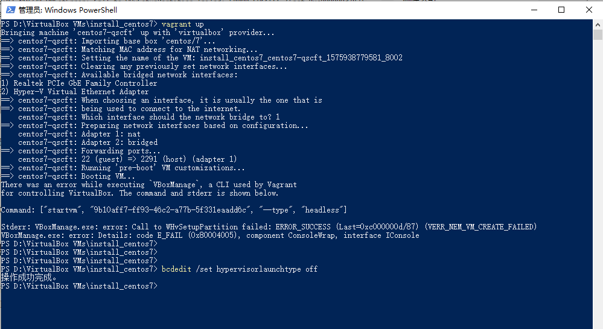

* content
{:toc}
> 基于 `Vagrant` 和 `Virtual Box` 虚拟化技术安装 `CentOS 7` 。


# Vagrant + Virtual Box 安装 CentOS 7

## 安装 Vagrant

### 下载

* https://www.vagrantup.com

* 选择对应的版本 Windows/MacOS/Linux 下载

### 安装

* 下载后安装
* 安装后采用命令 `vagrant` 测试是否安装成功

```bash
vagrant
```


## 安装 Virtual Box

### 下载

* https://www.virtualbox.org
* 选择对应的版本 Windows/MacOS/Linux 下载

### 安装

* 下载后安装
  * 跟安装 windows 应用程没区别


## 安装 CentOS 7

### 准备 CentOS 7 的 box 文件

* https://vagrantcloud.com/centos/boxes/7/versions/1905.1/providers/virtualbox.box

### 添加下载的 CentOS 7 的 box 到 vagrant

* 添加之前用命令 `vagrant box list` 查看 vagrant 本地 box 时是没有的

  ```bash
  vagrant box list
  ```

* vagrant box add centos/7 D:\downloads\virtualbox.box

  ```bash
  vagrant box add centos/7 D:\downloads\virtualbox.box
  ```

* 添加之后用命令 `vagrant box list` 查看 vagrant 本地 box 时是可以看到 centos/7 了

  ```bash
  vagrant box list
  ```

### 生成 Vagrantfile 文件

* 创建定指定目录，并在当前目录运行命令生成

  ```bash
  vagrant init centos/7
  ```

* 创建成功后可修改 `Vagrantfile` 文件信息

  ```bash
    # boxes at https://vagrantcloud.com/search.
    config.vm.box = "centos/7"
  
    # Disable automatic box update checking. If you disable this, then
    ...
    # config.vm.network "public_network"
    config.vm.network "public_network"
  
    # Share an additional folder to the guest VM. The first argument is
    ...
    #   vb.memory = "1024"
    # end
    
    config.vm.provider "virtualbox" do |vb|
          vb.memory = "4096"
          vb.name= "boazy-centos7"
          vb.cpus= 2
      end
    
    #
    # View the documentation for the provider you are using for more
    # information on available options.
    ...
  ```

### 创建 CentOS 7 虚拟机

* 执行命令 `vagrant up` 创建虚拟机

  ```bash
  vagrant up
  ```

* 打开 Virtual Box 看可以看到 CentOS 7 已创建成功

  * 执行命令 `vagrant up` 时可以同时打开  Virtual Box 查创建过程中

### 配置 CentOS 7 虚拟机

#### 配置 `用户名/密码 ` SSH 登陆

* 不配置的话 SSH 工具软件连接时会失败，报以下错误

```bash
Disconnected: No supported authentication methods available (server sent: gssapi-keyex,gssapi-with-mic)
```

* 在 `Virtual Box` 界面中打开 CentOS 7 `SSH` 界面
* 使用 `CentOS 7 用户` 登陆
* 修改 `/etc/ssh/sshd_config` 配置（需要管理权限）

```bash
vi /etc/ssh/sshd_config
```

```
# 修改文件内容属性值为 yes 后保存
PasswordAuthentication yes
```

* 重启 `sshd` 服务（需要管理权限）

```bash
systemctl restart sshd
```

### CentOS 7 用户

#### vagrant 用户/密码

```
vagrant/vagrant
```

#### root 用户名/密码

```
root/vagrant
```

## 所遇问题

### VERR_NEM_VM_CREATE_FAILED 

#### 错误描述



#### 解决方案

* Windows 命令窗口中执行命令（ 禁用 Hyper-V ）

```shell
bcdedit /set hypervisorlaunchtype off
```

* 执行完命令后重启计算机，再次尝试成功咯

