* content
{:toc}

# 搭建 CentOS 7 

## CentOS 7 搭建前说明

* 至于 Vagrant 的 `centos/7` 镜像如何下载及添加到 Vagrant 这里不再进行说明了，自行网络搜索
  * 也可查看《[Vagrant&VirtualBox-安装-CentOS7](https://poazy.github.io/2019/11/05/Vagrant&VirtualBox-%E5%AE%89%E8%A3%85-CentOS7/)》文档
  
* 创建3台` CentOS 7` 虚拟机器
  * IP 分别定为：10.198.0.91、10.198.0.92、10.198.0.93
  * 配置为：2CPU+4G

## 创建 `Vagrantfile` 文件

```
boxes = [
    {
        :name => "k8s-kubeadm-91",
        :eth1 => "10.198.0.91",
        :mem => "2048",
        :cpu => "2",
		:ssh => "2291"
    },
    {
        :name => "k8s-kubeadm-92",
        :eth1 => "10.198.0.92",
        :mem => "2048",
        :cpu => "2",
		:ssh => "2292"
    },
    {
        :name => "k8s-kubeadm-93",
        :eth1 => "10.198.0.93",
        :mem => "2048",
        :cpu => "2",
		:ssh => "2293"
    }
]

Vagrant.configure(2) do |config|

  config.vm.box = "centos/7"
  
   boxes.each do |opts|
      config.vm.define opts[:name] do |config|
        config.vm.hostname = opts[:name]
        config.vm.provider "vmware_fusion" do |v|
          v.vmx["memsize"] = opts[:mem]
          v.vmx["numvcpus"] = opts[:cpu]
        end

        config.vm.provider "virtualbox" do |v|
          v.customize ["modifyvm", :id, "--memory", opts[:mem]]
		  v.customize ["modifyvm", :id, "--cpus", opts[:cpu]]
		  v.customize ["modifyvm", :id, "--name", opts[:name]]
        end

        config.vm.network :public_network, ip: opts[:eth1]
		
		# 先禁用默认 22->2222 的 ssh 转发
		config.vm.network :forwarded_port, guest: 22, host: 2222, id: "ssh", disabled: "true"
		# 再创建一个 22->自定义端口 的 ssh 转发
		config.vm.network :forwarded_port, guest: 22, host: opts[:ssh]
      end
  end

end
```

## 执行 `vagran up` 命令

* 在 `Vagrantfile 文件` 的当前目录下执行

```bash
vagran up
```

* CentOS 7 创建结果


## SSH 时 Disconnected 问题

* 使用 SSH 工具软件连接时出现如下错误

```bash
Disconnected: No supported authentication methods available (server sent: gssapi-keyex,gssapi-with-mic)
```

* 在 VirtualBox 下使用 `vagrant/vagrant` 账号登陆，执行以下命令处理
  * 3台机器都执行命令

```bash
sudo -i
vi /etc/ssh/sshd_config
```

```bash
# 修改 /etc/ssh/sshd_config 文件内容中 PasswordAuthentication 属性值为 yes
PasswordAuthentication yes
```

```bash
# 重启 sshd
systemctl restart sshd
```

## SSH CentOS 7 成功

* 用户名/密码：vagrant/vagrant

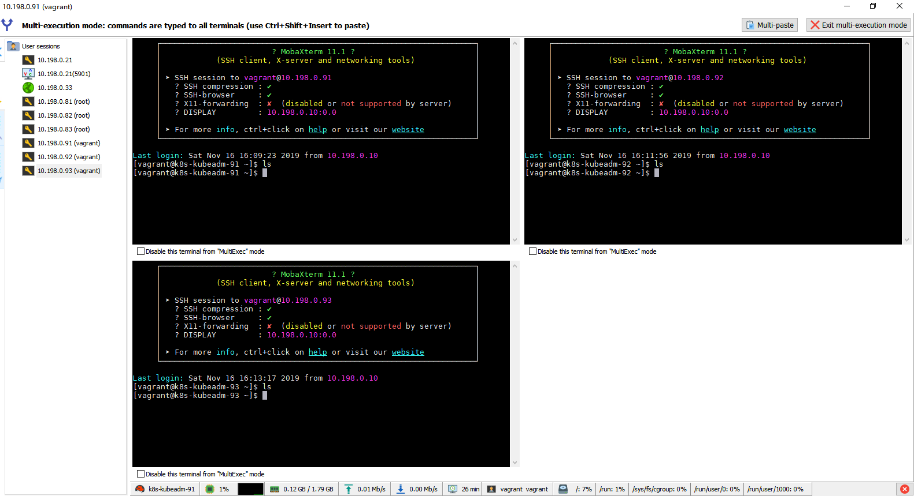

## 同步 CentOS 7 时间

- 避免由于 `CentOS 7` 系统时间与当前时间的时间差过大引起不必要的错误响应安装

```bash
timedatectl status
sudo cp /usr/share/zoneinfo/Asia/Shanghai /etc/localtime

sudo yum install -y ntp
sudo ntpdate pool.ntp.org && hwclock -w
```

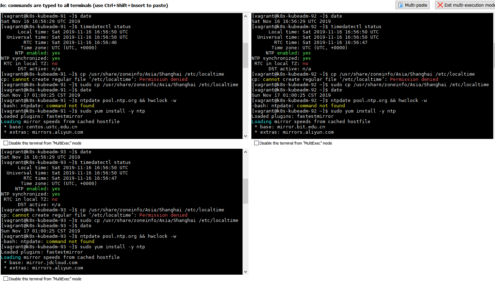

# 环境依赖处理

## CentOS `yum` 更新

```bash
sudo yum -y update
```


## 安装依赖

```bash
sudo yum install -y conntrack ipvsadm ipset jq sysstat curl iptables libseccomp
```


# 使用版本

| 组件                               | 版本号   | 备注     |
| ---------------------------------- | -------- | -------- |
| Docker                             | 19.03.5  |          |
| kubeadm                            | 1.14.9-0 |          |
| kubelet                            | 1.14.9-0 |          |
| kubectl                            | 1.14.9-0 |          |
| k8s.gcr.io/kube-apiserver          | v1.14.9  |          |
| k8s.gcr.io/kube-controller-manager | v1.14.9  |          |
| k8s.gcr.io/kube-scheduler          | v1.14.9  |          |
| k8s.gcr.io/kube-proxy              | v1.14.9  |          |
| k8s.gcr.io/pause                   | 3.1      |          |
| k8s.gcr.io/etcd                    | 3.3.10   |          |
| k8s.gcr.io/coredns                 | 1.3.1    |          |
| calico                             | 3.10     | 网络插件 |

# 安装 Docker

## 安装依懒

```bash
sudo yum install -y yum-utils device-mapper-persistent-data lvm2
```


## 配置 Docker `repo`

```bash
sudo yum-config-manager --add-repo http://mirrors.aliyun.com/docker-ce/linux/centos/docker-ce.repo
```

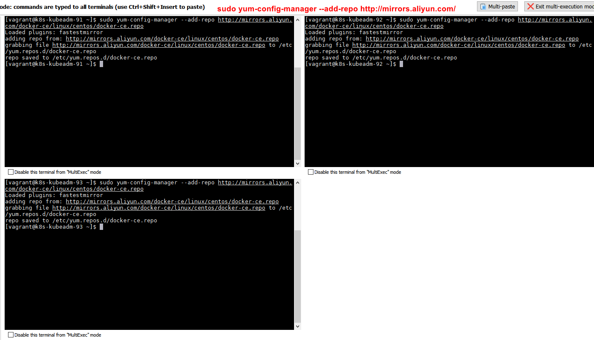

## 更新 `yum` 软件源缓存

```bash
sudo yum makecache fast
```

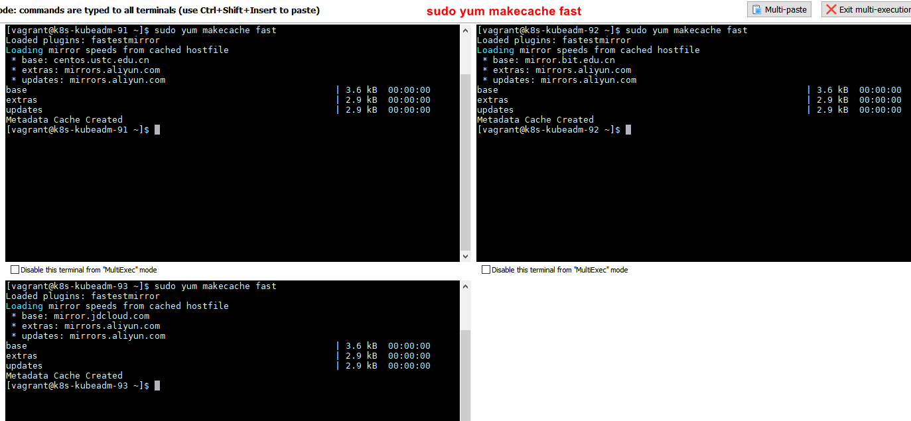

## 安装 Docker

```bash
sudo yum install -y docker-ce docker-ce-cli containerd.io
```


## 启动 Docker

```bash
# 设置 docker 开启启动并启动 docker
sudo -i && systemctl enable docker && systemctl start docker
```

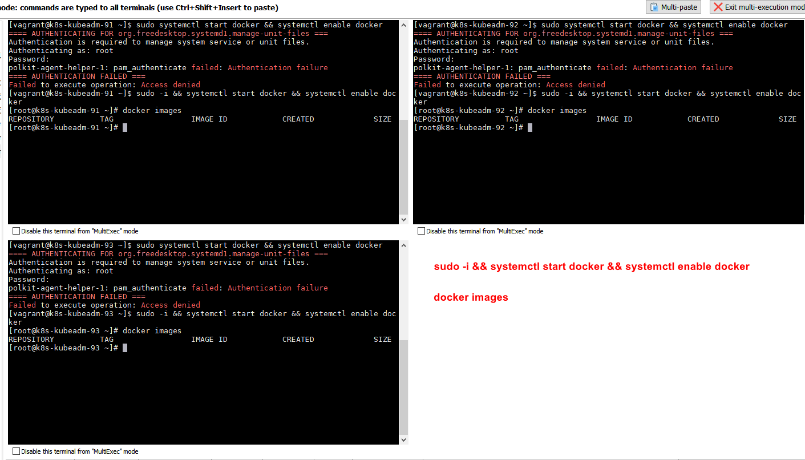

## 配置镜像加速

```bash
# 编辑 daemon.json 文件
sudo vi /etc/docker/daemon.json
```

```bash
# 编辑 daemon.json 文件信息添加 registry-mirrors
{
  "registry-mirrors": [
    "https://dockerhub.azk8s.cn",
    "https://reg-mirror.qiniu.com"
  ]
}
```

```bash
# 保存 daemon.json 文件后
# 重新加载 daemon 配置并重启 docker
sudo -i && systemctl daemon-reload && systemctl restart docker
```


# 搭建 K8S 集群

## 设置 CentOS 7 `hosts`

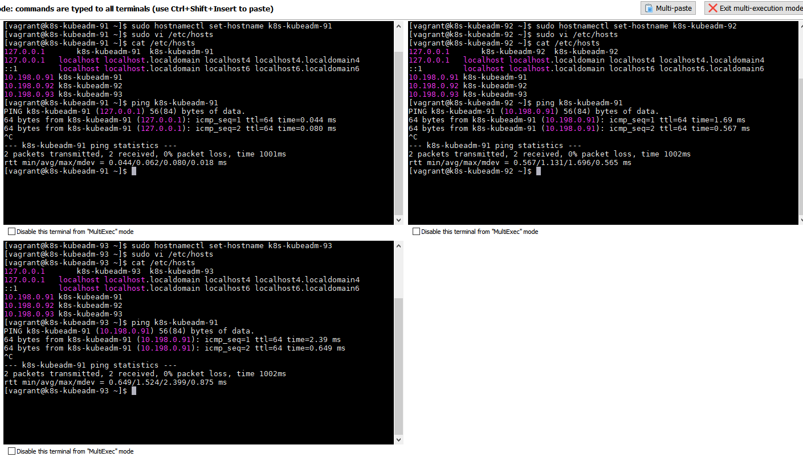

### 10.198.0.91

```bash
sudo hostnamectl set-hostname k8s-kubeadm-91
```

```bash
# 编辑 hosts 文件添加机器映射
sudo vi /etc/hosts
```

```bash
# 在 hosts 文件中添加以下信息
10.198.0.91 k8s-kubeadm-91
10.198.0.92 k8s-kubeadm-92
10.198.0.93 k8s-kubeadm-93
```

### 10.198.0.92

```bash
sudo hostnamectl set-hostname k8s-kubeadm-92
```

```bash
# 编辑 hosts 文件添加机器映射
sudo vi /etc/hosts
```

```bash
# 在 hosts 文件中添加以下信息
10.198.0.91 k8s-kubeadm-91
10.198.0.92 k8s-kubeadm-92
10.198.0.93 k8s-kubeadm-93
```

### 10.198.0.93

```bash
sudo hostnamectl set-hostname k8s-kubeadm-93
```

```bash
# 编辑 hosts 文件添加机器映射
sudo vi /etc/hosts
```

```bash
# 在 hosts 文件中添加以下信息
10.198.0.91 k8s-kubeadm-91
10.198.0.92 k8s-kubeadm-92
10.198.0.93 k8s-kubeadm-93
```

## CentOS 7 基础配置

```bash
# 获取权限，执行下面的命令要权限的
sudo -i

# 1) 关闭防火墙
systemctl stop firewalld && systemctl disable firewalld

# 2) 关闭selinux
# 将 SELinux 设置为 permissive 模式(将其禁用)
setenforce 0
sed -i 's/^SELINUX=enforcing$/SELINUX=permissive/' /etc/selinux/config

# 3) 关闭swap
swapoff -a
sed -i '/swap/s/^\(.*\)$/#\1/g' /etc/fstab

# 4) 配置iptables的ACCEPT规则
iptables -F && iptables -X && iptables -F -t nat && iptables -X -t nat && iptables -P FORWARD ACCEPT

# 5) 设置系统参数
cat <<EOF >  /etc/sysctl.d/k8s.conf
net.bridge.bridge-nf-call-ip6tables = 1
net.bridge.bridge-nf-call-iptables = 1
EOF

sysctl --system
```


## 安装 kubeXXX 三大组件

### 配置 `yum` 源

```bash
cat <<EOF > /etc/yum.repos.d/kubernetes.repo
[kubernetes]
name=Kubernetes
baseurl=http://mirrors.aliyun.com/kubernetes/yum/repos/kubernetes-el7-x86_64
enabled=1
gpgcheck=0
repo_gpgcheck=0
gpgkey=http://mirrors.aliyun.com/kubernetes/yum/doc/yum-key.gpg
       http://mirrors.aliyun.com/kubernetes/yum/doc/rpm-package-key.gpg
EOF
```


### 安装 `kubeadm`&`kubelet`&`kubectl`

#### 查看版本

```bash
yum list kubeadm --showduplicates | sort -r
```

#### 安装

* 版本选用 `1.14.9`

```bash
sudo yum install -y kubeadm-1.14.9-0 kubelet-1.14.9-0 kubectl-1.14.9-0
```


### Docker 和 K8S 设置同一个 `cgroup`

#### docker 设置

```bash
# 编辑 /etc/docker/daemon.json 文档
sudo vi /etc/docker/daemon.json
```

```bash
# 在 /etc/docker/daemon.json 文件中添加 exec-opts 属性内容
{
  "exec-opts": ["native.cgroupdriver=systemd"],
  "registry-mirrors": [
    "https://dockerhub.azk8s.cn",
    "https://reg-mirror.qiniu.com"
  ]
}
```

```bash
# 刷新 daemon.json 配置 并重启 docker
sudo -i && systemctl daemon-reload && systemctl restart docker
```


#### kubelet 设置

```bash
sed -i "s/cgroup-driver=systemd/cgroup-driver=cgroupfs/g" /etc/systemd/system/kubelet.service.d/10-kubeadm.conf
```

* 提示中的 `sed: can't read /etc/systemd/system/kubelet.service.d/10-kubeadm.conf: No such file or directory` **并不是报错**！
  * 命令为检验 kubelet 的 cgroup 方式是否为 systemd
  * 如果文件存在就将 kubelet 的 cgroup 方式修改为 systemd
  * 如果文件不存在，（kubelet 的 cgroup 方式会为 systemd）无需处理


### 启动 kubelet

```bash
# 激活 kubelet 开启启动 并启动 kubelet
sudo -i && systemctl enable kubelet && systemctl start kubelet
```

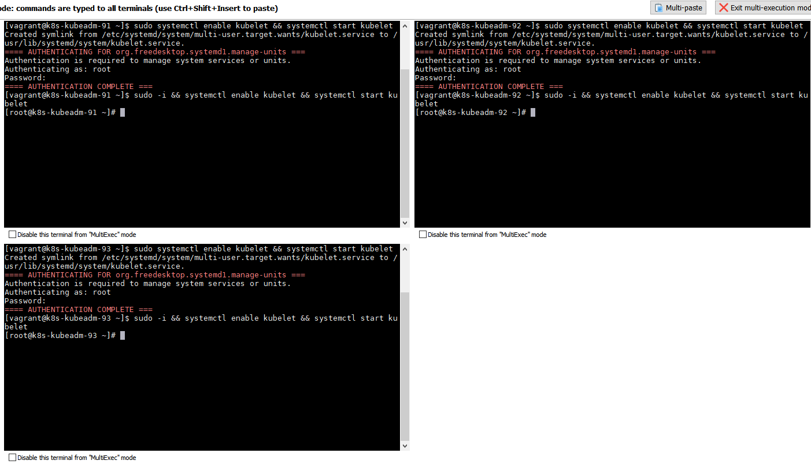

### 拉取 `kubeadm config images`

#### 查看配置镜像

```bash
kubeadm config images list
```

* 国外的镜像会提示 `could not fetch` ，是因为 `https://dl.k8s.io` 需要科学上网才能访问

```bash
I1117 14:54:08.767675    5094 version.go:96] could not fetch a Kubernetes version from the internet: unable to get URL "https://dl.k8s.io/release/stable-1.txt": Get https://dl.k8s.io/release/stable-1.txt: net/http: request canceled while waiting for connection (Client.Timeout exceeded while awaiting headers)
I1117 14:54:08.767859    5094 version.go:97] falling back to the local client version: v1.14.9
k8s.gcr.io/kube-apiserver:v1.14.9
k8s.gcr.io/kube-controller-manager:v1.14.9
k8s.gcr.io/kube-scheduler:v1.14.9
k8s.gcr.io/kube-proxy:v1.14.9
k8s.gcr.io/pause:3.1
k8s.gcr.io/etcd:3.3.10
k8s.gcr.io/coredns:1.3.1
```


#### 创建拉取镜像脚本

```bash
vi kubeadm.sh
```

```bash
#!/bin/bash

set -e

KUBE_VERSION=v1.14.9
KUBE_PAUSE_VERSION=3.1
ETCD_VERSION=3.3.10
CORE_DNS_VERSION=1.3.1

GCR_URL=k8s.gcr.io
ALIYUN_URL=registry.cn-hangzhou.aliyuncs.com/google_containers

images=(kube-proxy:${KUBE_VERSION}
kube-scheduler:${KUBE_VERSION}
kube-controller-manager:${KUBE_VERSION}
kube-apiserver:${KUBE_VERSION}
pause:${KUBE_PAUSE_VERSION}
etcd:${ETCD_VERSION}
coredns:${CORE_DNS_VERSION})

for imageName in ${images[@]} ; do
  docker pull $ALIYUN_URL/$imageName
  docker tag  $ALIYUN_URL/$imageName $GCR_URL/$imageName
  docker rmi $ALIYUN_URL/$imageName
done
```


#### 执行脚本拉取镜像

```bash
# 运行自创建的 kubeadm.sh 脚本
sudo sh ./kubeadm.sh

# 查看镜像
sudo docker images
```


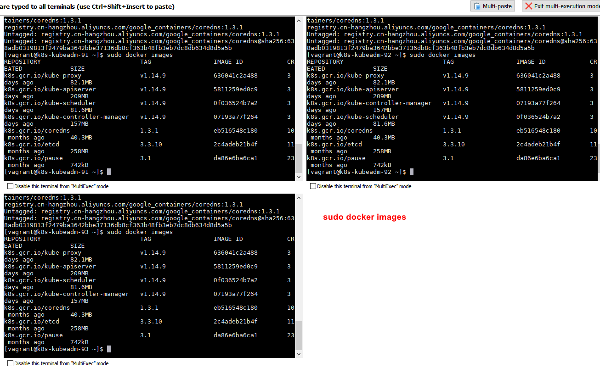

#### 将镜像推送阿里云仓库

* 可以不用搞这步，玩这步主要学习下如何 push 到里云仓库

* 将上面拉取下来的 `kubeadm config images` 镜像 `push` 到自己账号的阿里云仓库
* 需要有自己的阿里云账号

##### 登陆阿里云账号

```bash
sudo docker login --username=填写你的阿里云账号 registry.cn-shenzhen.aliyuncs.com
```

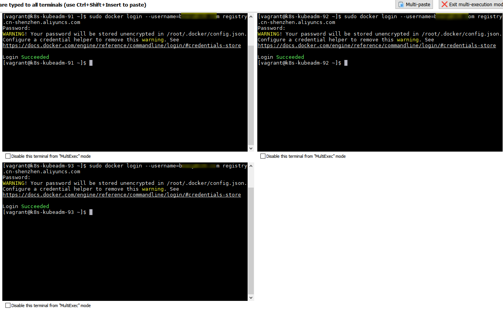

##### 创建推送脚本

```bash
sudo vi kubeadm-push-aliyun.sh
```

```bash
#!/bin/bash

set -e

KUBE_VERSION=v1.14.9
KUBE_PAUSE_VERSION=3.1
ETCD_VERSION=3.3.10
CORE_DNS_VERSION=1.3.1

GCR_URL=k8s.gcr.io
# 地址样例：registry.cn-shenzhen.aliyuncs.com/你的命名空间
ALIYUN_URL=填写你的阿里云地址

images=(kube-proxy:${KUBE_VERSION}
kube-scheduler:${KUBE_VERSION}
kube-controller-manager:${KUBE_VERSION}
kube-apiserver:${KUBE_VERSION}
pause:${KUBE_PAUSE_VERSION}
etcd:${ETCD_VERSION}
coredns:${CORE_DNS_VERSION})

for imageName in ${images[@]} ; do
  docker tag $GCR_URL/$imageName $ALIYUN_URL/$imageName
  docker push $ALIYUN_URL/$imageName
  docker rmi $ALIYUN_URL/$imageName
done
```

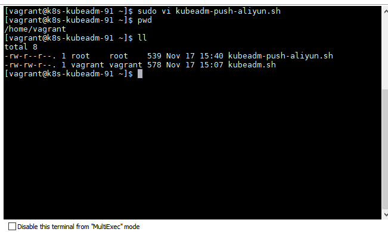

 ##### 执行推送脚本

```bash
sudo sh ./kubeadm-push-aliyun.sh
```


## 初始化 Master 节点

* https://kubernetes.io/docs/reference/setup-tools/kubeadm/kubeadm/

```bash
# 本地已有镜像
# k8s-kubeadm-91 机器作为 master，则只 k8s-kubeadm-91 机器执行以下命令
sudo kubeadm init --kubernetes-version=1.14.9 --apiserver-advertise-address=10.198.0.91 --pod-network-cidr=10.244.0.0/16
```


* 如果 初始化命令不小心出错了，可用执行 `kubeadm reset` 命令进行重置后，再次执行初始化命令
* 初始化成功记录结果（后面要按结果执行命令）

```bash
Your Kubernetes control-plane has initialized successfully!

To start using your cluster, you need to run the following as a regular user:

  mkdir -p $HOME/.kube
  sudo cp -i /etc/kubernetes/admin.conf $HOME/.kube/config
  sudo chown $(id -u):$(id -g) $HOME/.kube/config

You should now deploy a pod network to the cluster.
Run "kubectl apply -f [podnetwork].yaml" with one of the options listed at:
  https://kubernetes.io/docs/concepts/cluster-administration/addons/

Then you can join any number of worker nodes by running the following on each as root:

kubeadm join 10.198.0.91:6443 --token t2k9nq.pe03gxdd2xq7esjh \
    --discovery-token-ca-cert-hash sha256:ec1eedab4f3d522468e9b3c10008109e2a4442d41a2e37b4f92e90839cf3df47
```

### run the following as a regular

```bash
mkdir -p $HOME/.kube
sudo cp -i /etc/kubernetes/admin.conf $HOME/.kube/config
sudo chown $(id -u):$(id -g) $HOME/.kube/config
```


### 查看集群信息

```bash
# 查看下情况，输出 Kubernetes master is running at https://10.198.91:6443 表示成功
kubectl cluster-info
```


### 查看 POD 情况

```bash
# 过一会查看，因为相关组件正在创建启动中
# 查看下 pods 情况，注意 coredns 为 Pending 状态没有启动，需要安装网络插件
kubectl get pods -n kube-system
```


### 健康检查

```bash
curl -k https://localhost:6443/healthz
```

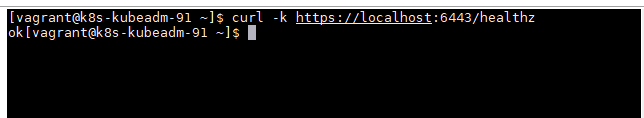

### 安装网络插件

* 安装 `coredns` 所需要的网络插件（只需要在 Master 节点上安装）
* 选择网络插件
  * https://kubernetes.io/docs/concepts/cluster-administration/addons/
* 这里选择 `calico` 作为本次使用的网络插件
  * https://docs.projectcalico.org/v3.10/getting-started/kubernetes/

#### 安装 `calico` 网络插件

##### 先拉取镜像

```bash
sudo docker pull calico/pod2daemon-flexvol:v3.10.0
sudo docker pull calico/kube-controllers:v3.10.0
sudo docker pull calico/cni:v3.10.0
```


##### 在 K8S 中安装 `calico`

```bash
# 在 K8S 中安装 calico
kubectl apply -f https://docs.projectcalico.org/v3.10/manifests/calico.yaml
```


##### 检查 POD 的状态

```bash
# 过一会 coredns 的状态正常已经跑起来了
# 确认一下 calico 是否安装成功
kubectl get pods --all-namespaces -w
```


## Worker 节点加入集群

* 在 Worker 节点 `10.198.0.92` 和 `10.198.0.93` 机器上执行命令加入到集群

```bash
sudo kubeadm join 10.198.0.91:6443 --token t2k9nq.pe03gxdd2xq7esjh \
    --discovery-token-ca-cert-hash sha256:ec1eedab4f3d522468e9b3c10008109e2a4442d41a2e37b4f92e90839cf3df47
```


## 恭喜 K8S 集群搭建成功

* 在 Master 节点 `10.198.0.91` 上查看 

```bash
kubectl get nodes
```


* 当看到上面的 `kubectl get nodes` 结果，恭喜 K8S 搭建成功

## docker ps -a
* 有三个容器状态好像不正常了（晚些时间有空再看看）


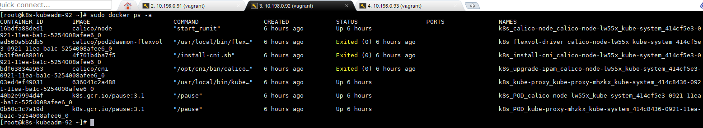


## kubectl get pods --all-namespaces -w

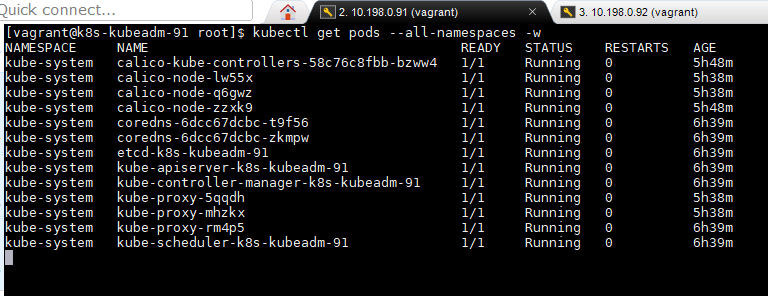

# 附录A