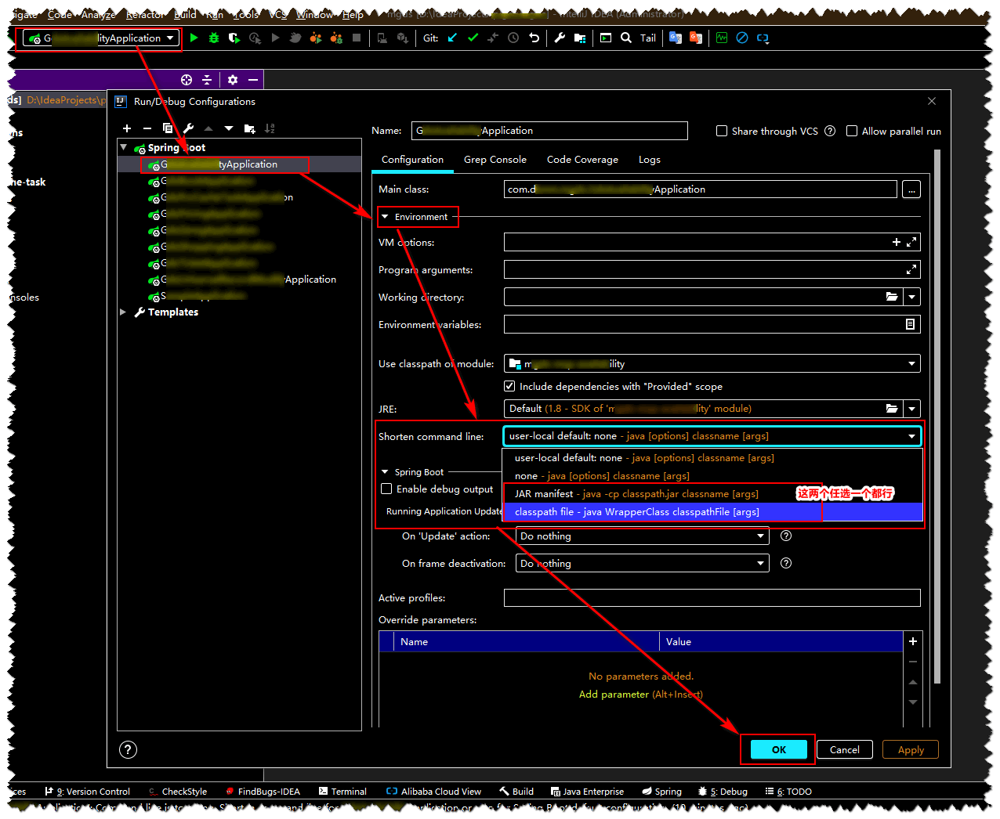

* content
{:toc}

# IDEA 运行 Spring Boot 应用时报命令过长问题

## IDEA 提示错误信息

```
Error running 'XxxApplication':
Command line is too long. Shorten command line for XxxApplication or als for Spring Boot default configuration.
```


## 解决方案

### 【方案一】workspace.xml

* 对本工程下所有的 Spring Boot XxxApplication 生效，不用对一个一个的 XxxApplication 设置配置

* 在 IDEA 工程目录下的 workspace.xml 文件中的 <component name="PropertiesComponent"> 标签节点中添加 <property name="dynamic.classpath" value="true" /> 属性标签


### 【方案二】Run/Debug Configurations

* 要对本工程下所有的 Spring Boot XxxApplication 设置配置，设置配置一个 XxxApplication 就只对这个设置配置过的 XxxApplicaiton 生效

* 在 IDEA 选中 `Edit Configurations ` 后在弹出来的 `Run/Debug Configurations `  窗口左侧选 Spring Boot 的应用 -> `Environment` -> `Shorten command line` 选项中选则 `JAR manifest` 或 `classpath file` -> `OK` 就可解决设置的 XxxApplication 启动的错误问题



