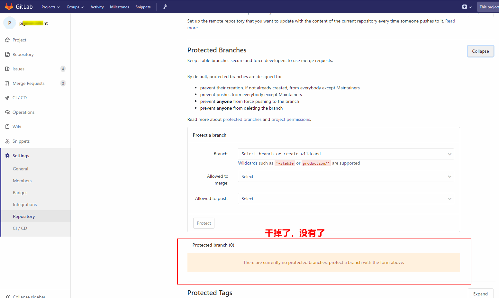
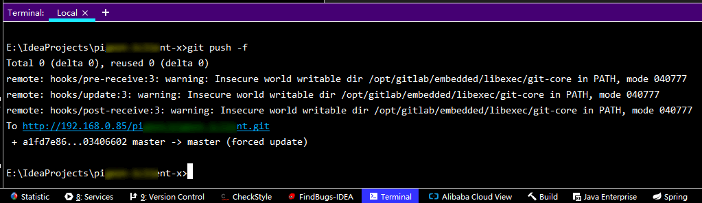
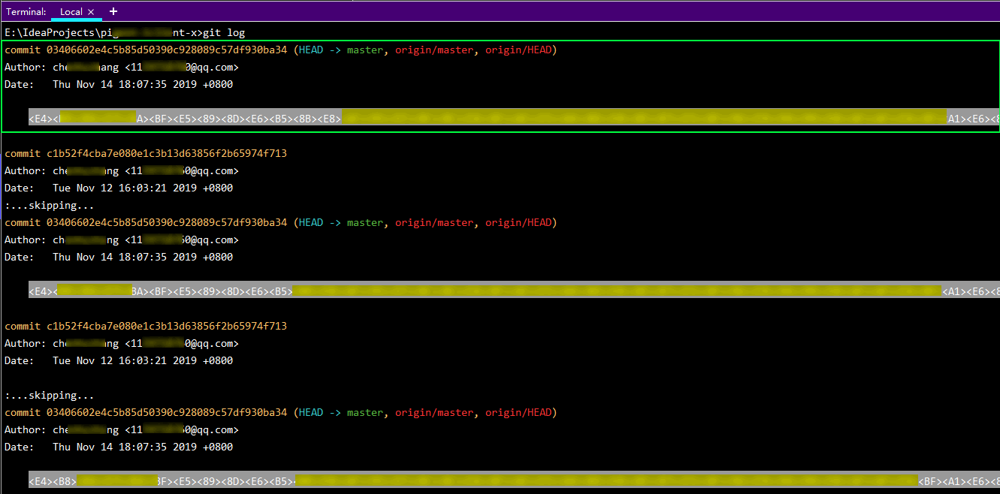
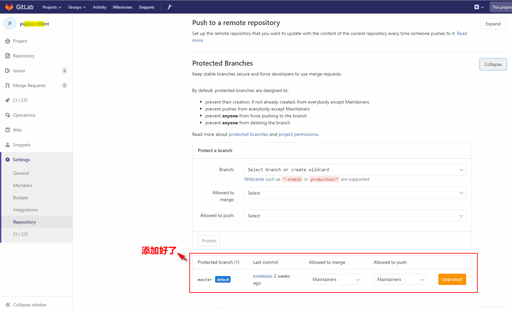

* content
{:toc}

# 0、前言

* 撤回本地和远程代码（包括已 push 的版本）

* 这个方法被撤回的版本在 Gitlab 上不会有 `Commits` 记录，所以要考虑清楚是否可以，才往下看
* 要在 Gitlab 上设置去掉分支保护，才能撤消远程的
* 撤消前请对代码做好备份，避免代码可能丢了

## 操作前备份！备份！备份！

### 备份！备份！备份！


# 1、查看 Git 日志选则要撤回的版本号

## 命令 `git log`

```bash
git log
```

* 这里要撤回到版本号为 `03406602e4c5b85d50390c928089c57df930ba34` 的版本


## IDEA 查看历史版本


#  2、本地文件撤回 

## 命令 `git reset --hard 版本号`

```bash
git reset --hard 03406602e4c5b85d50390c928089c57df930ba34
```

* 本地撤回成功


# 3、远程撤回

## 命令 `git push -f`

```bash
git push -f
# 或
git push origin master -f
```

* 这个命令 `-f` 表示强制拿本地版本覆盖远程版本，一定要注意！别把代码搞没了！
* push 失败，error: failed to push some refs to 'http://192.168.0.85:xxx/zzz.git'
*  这是因为 master 分支受保护，处理方式是去掉这个保护。在 Gitlab 上设置去掉 


# 4、到 Gitlab 设置去掉 master 分支保护

* settings -> Protected Branches(Expand) -> Unprotect
* 如果是撤回非 master 分支，是不需要这步操作的，因为 Gitlab 默认只给 master 分支有保护，其他分支默认情况下无保护的





# 5、再次远程撤回

## 命令 `git push -f`

```bash
git push -f
# 或
git push origin master -f
```

* push 成功，OK 远程撤回成功。可以查看日志检验查看。




# 6、查看 Git 日志检验查看

## 命令 `git log`

```bash
git log
```



## IDEA 查看历史版本


# 7、到 Gitlab 上给 master 设回分支保护

* master 分支保护必须设置回来
* settings -> Protected Branches(Expand) -> Proect
* 如果是撤回非 master 分支，是不需要这步操作的，因为 Gitlab 默认只给 master 分支有保护，其他分支默认情况下无保护的


