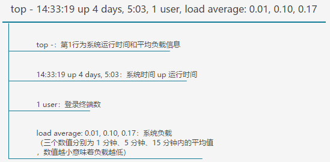
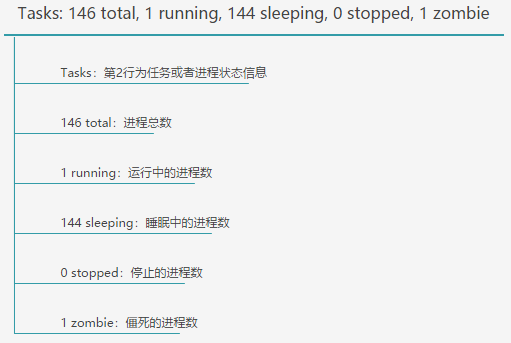
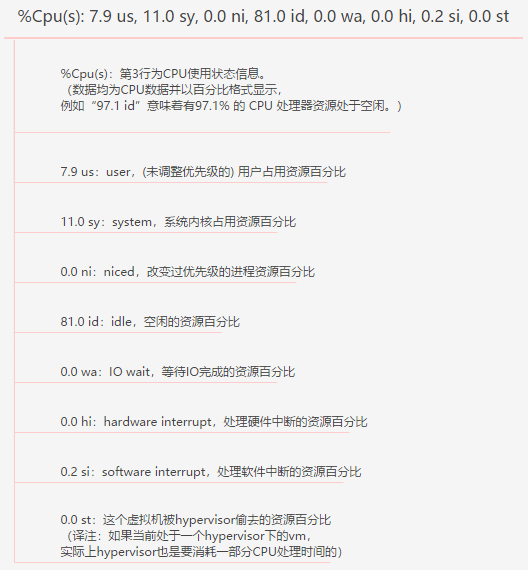
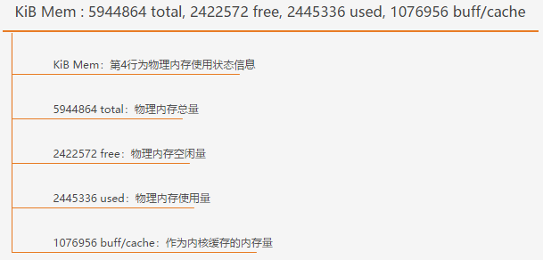
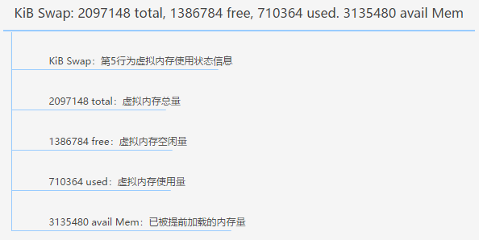
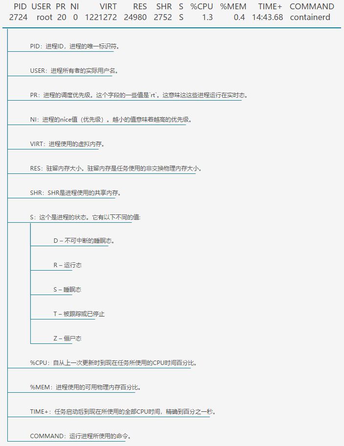

* content
{:toc}

> 对 Linux（CentOS 7） `top` 命令的执行结果进行解释。


# top 命令
```bash
top
```
```
top - 14:33:19 up 4 days,  5:03,  1 user,  load average: 0.01, 0.10, 0.17
Tasks: 146 total,   1 running, 144 sleeping,   0 stopped,   1 zombie
%Cpu(s):  7.9 us, 11.0 sy,  0.0 ni, 81.0 id,  0.0 wa,  0.0 hi,  0.2 si,  0.0 st
KiB Mem :  5944864 total,  2422572 free,  2445336 used,  1076956 buff/cache
KiB Swap:  2097148 total,  1386784 free,   710364 used.  3135480 avail Mem

  PID USER      PR  NI    VIRT    RES    SHR S  %CPU %MEM     TIME+ COMMAND
 2724 root      20   0 1221272  24980   2752 S   1.3  0.4  14:43.68 containerd
 2728 root      20   0  743372  56048   5548 S   1.3  0.9  21:16.52 dockerd
  654 root      20   0  109092   6616   2408 S   0.7  0.1   4:35.33 containerd-shim
```

# top 信息解释
## 第一行信息



## 第二行信息



## 第三行信息



## 第四行信息



## 每五行信息



## 进程信息



