* content
{:toc}
> 记录一下 Windows 下 tesseract-ocr 安装
>
> 下载、安装、环境变量配置、简易使用


# tesseract-ocr 相关地址

```html
https://github.com/tesseract-ocr
https://github.com/tesseract-ocr/tesseract/wiki
https://github.com/UB-Mannheim/tesseract/wiki
https://digi.bib.uni-mannheim.de/tesseract/
https://sourceforge.net/projects/vietocr/files/jTessBoxEditor/
```


# tesseract-ocr 安装截图

## 下载

```html
https://github.com/UB-Mannheim/tesseract/wiki
# 选择合适的版本下载
https://digi.bib.uni-mannheim.de/tesseract/
```

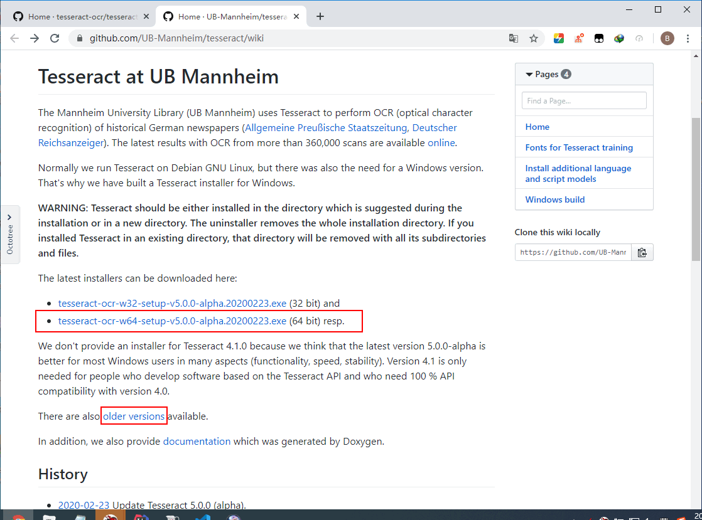

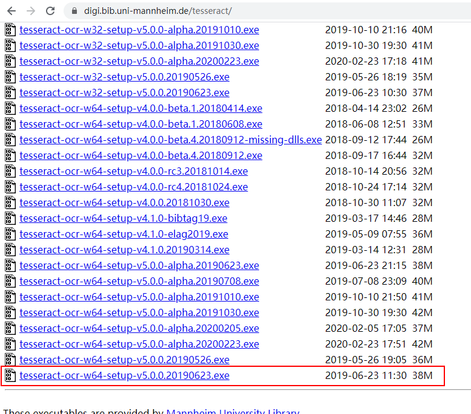

## 安装

```bash
tesseract-ocr-w64-setup-v5.0.0.20190623.exe
```

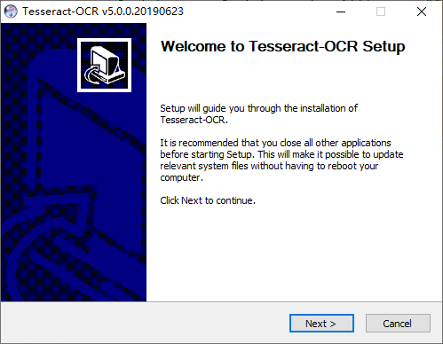

* 选择安装可以识别的中文包

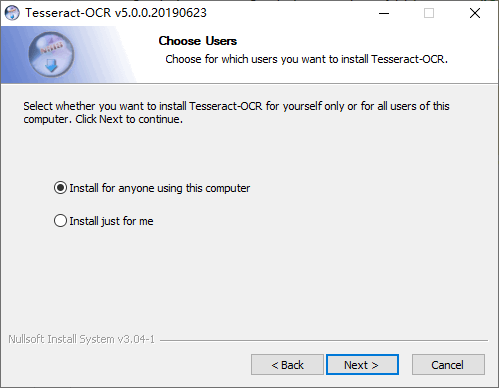

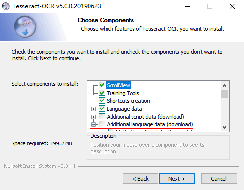

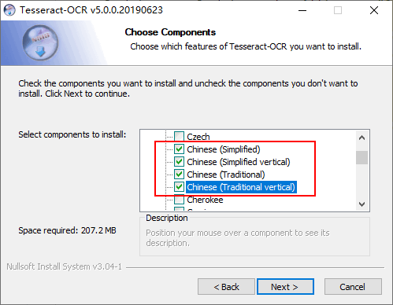

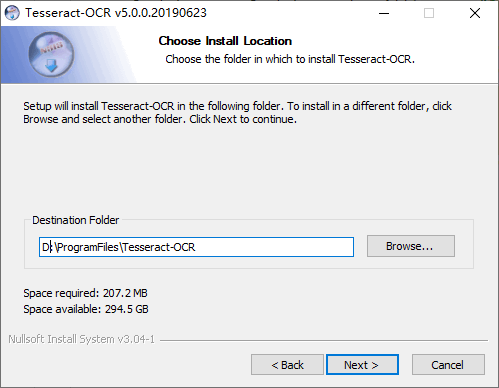

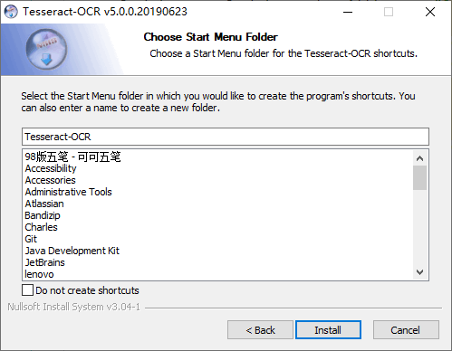

* 如果下载一直卡在 Connection ... 时需要配置 hosts

> 通过 https://www.ipaddress.com/ 查域名 raw.githubusercontent.com 的IP地址，然后配置 hosts 文件

```bash
199.232.28.133 raw.githubusercontent.com
```

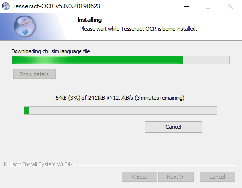

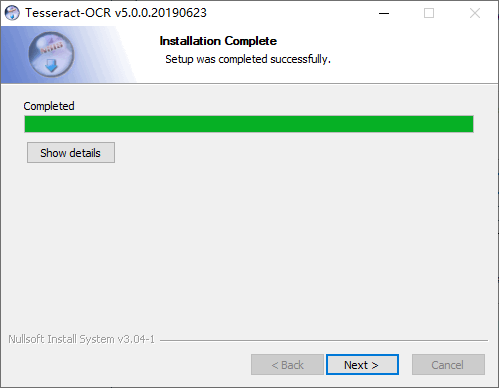

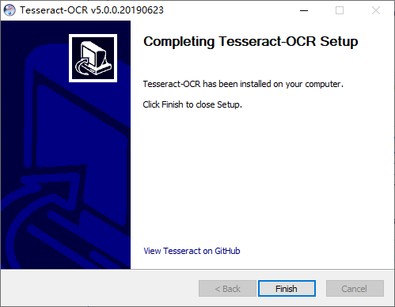

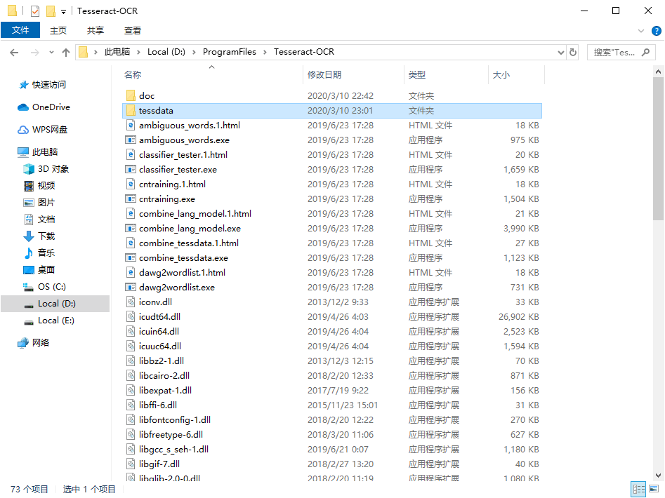


## 环境变量

* 设置 `TESSDATA_PREFIX` 变量

```bash
TESSDATA_PREFIX
```

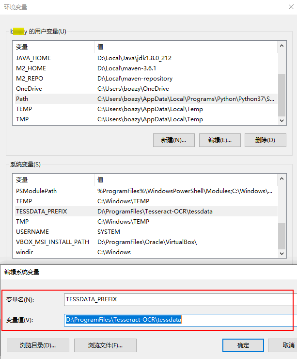

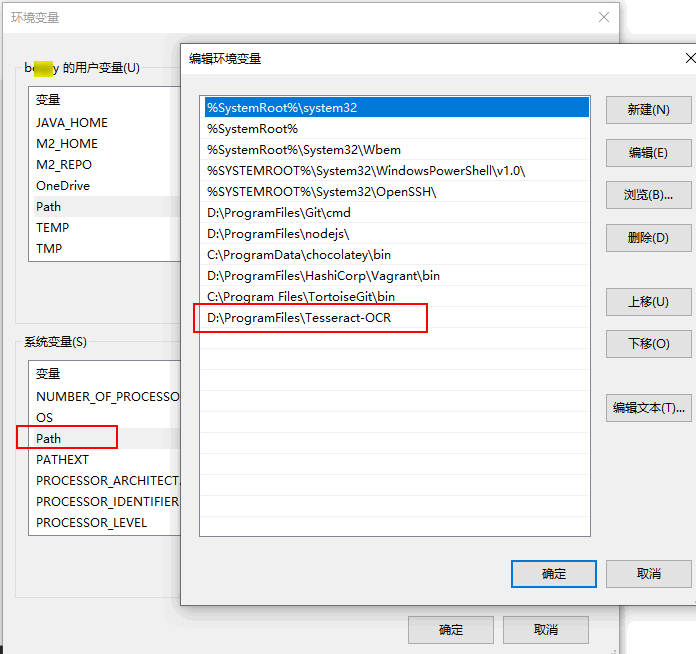

## 命令测试

* 设置好后可以输入命令 `tesseract --version` 看看是否OK

```bash
tesseract --version
```

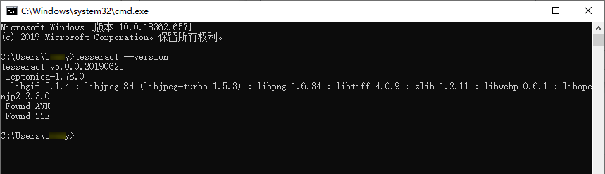

## 验证码识别

```bash
tesseract d:\test\codeImage.jpg d:\test\codeText --psm 10
```

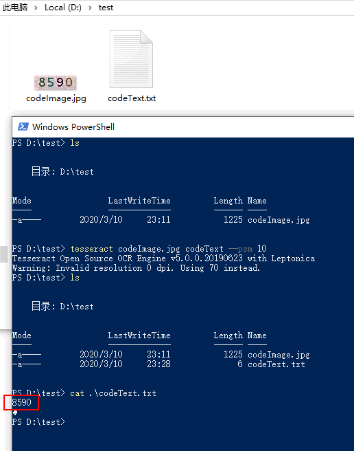


# 参考

```http
https://www.cnblogs.com/channel9/p/12227166.html
https://stackoverflow.com/questions/57160892/tesseract-error-warning-invalid-resolution-0-dpi-using-70-instead
```

