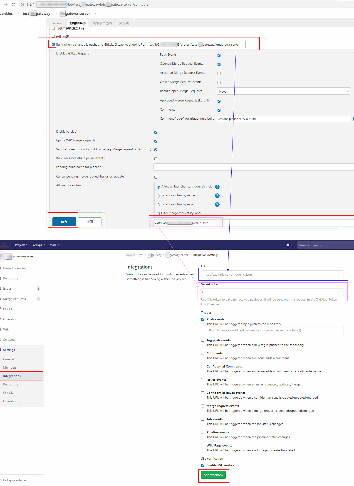

* content
{:toc}

> 在 GitLab 设置 Webhook 触发 Jenkins 任务。


# Jenkins 配置

```java
[任务] -> 配置 -> 构建触发器
```
> 勾选 Build when a change is pushed to GitLAB. ...  （选荐中的 http url 用于 GitLab 配置）
>
> 展开 `高级...` ，点 `Generate` 生成 Secret token      （生成的 Secret token 用于 GitLab 配置）
>
> 点 `保存` 或 `应用` 


# GitLab 配置

```java
[GitLab页面打开你的gitlab项目] -> Settings -> Integrations
```

>URL 填写 Jenkins 勾选 Build when a .... 中的 http URL
>
>Secret Token 填写 Jenkins 中生成 Secret token 值
>
>Trigger 中默认即可 或 根据自己的场景设置
>
>占击 `Add webhook` 即可添加成功
>
>可以测试通不通，取决于 GitLab 那边是否网络是否能够访问到 Jenkins !


# 截图说明



