* content
{:toc}

> 基于 IDEA 2020.1.1 版本配置，包括截图记录和说明。


# 配置 JDK

> 提交本地环境要先安装配置好 JDK

```java
File -> New Projects Settings -> Structure for New Projects... -> Project（对所有新建项目有效）
File -> Project Stucture... -> Project Settings -> Project（仅对当前本项目有效）
```

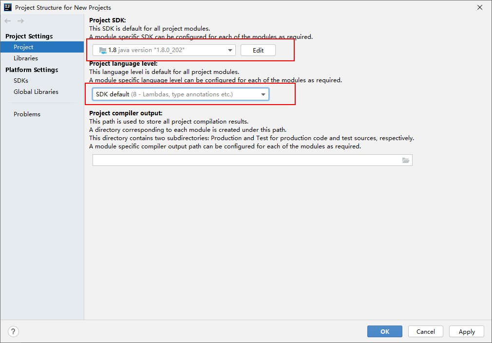


# 配置 Maven

> 前提本地环境要先安装配置好 Maven

```java
File -> New Projects Settings -> Structure for New Projects... -> Build,Execution,Deployment -> Build Tools -> Maven（对所有新建项目有效）
File -> Settings... -> Build,Execution,Deployment -> Build Tools -> Maven（仅对当前本项目有效）
```

> 勾选 Always update snapshots ，永远更新快照版 jar 包
>
> 配置 Maven 目录和用户 settings 配置文件

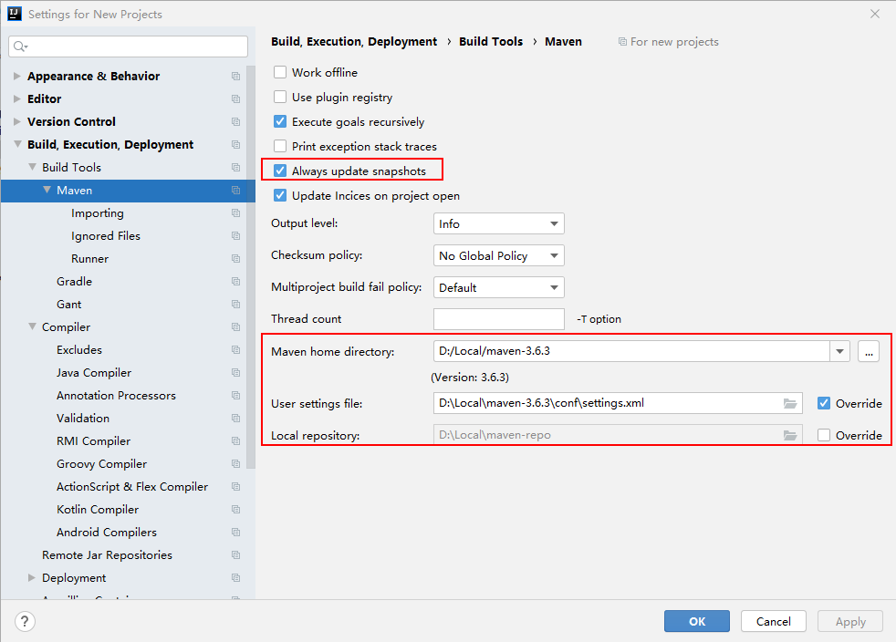

> 配置 JDK for importer

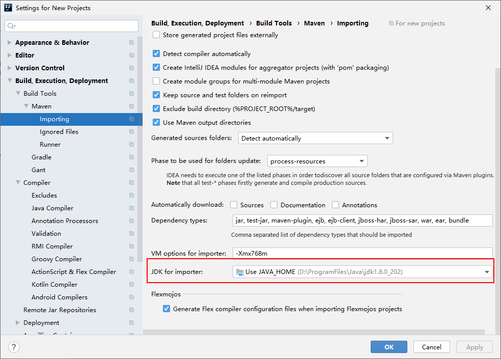

> 配置 Runner 的 JRE
>
> 勾选 Skip Tests ，为跳过测试

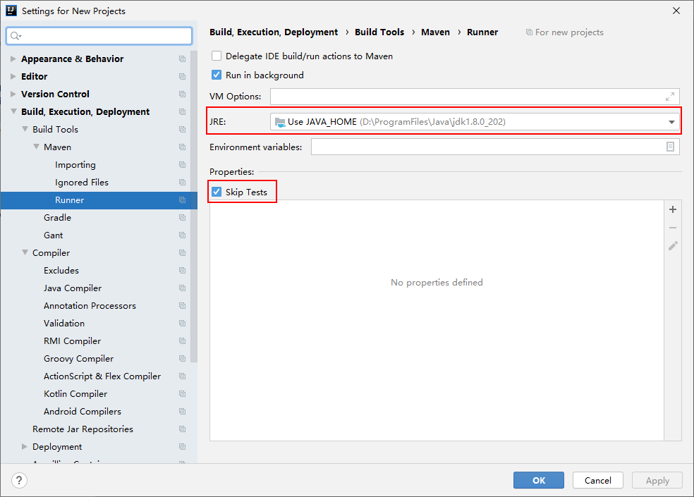


# 配置启动时不打开项目

> 配置 IDEA 启动时不自动打开最后打开的项目，而是让 IDEA 启动后让用户选择要打开的项目

```java
File -> Settings... -> Appearance & Behavior -> System Settings
```

> 取消勾选 Reopen last project on startup
>
> 也可勾选 Open project in new window，勾选后自动在新的窗口打开项目

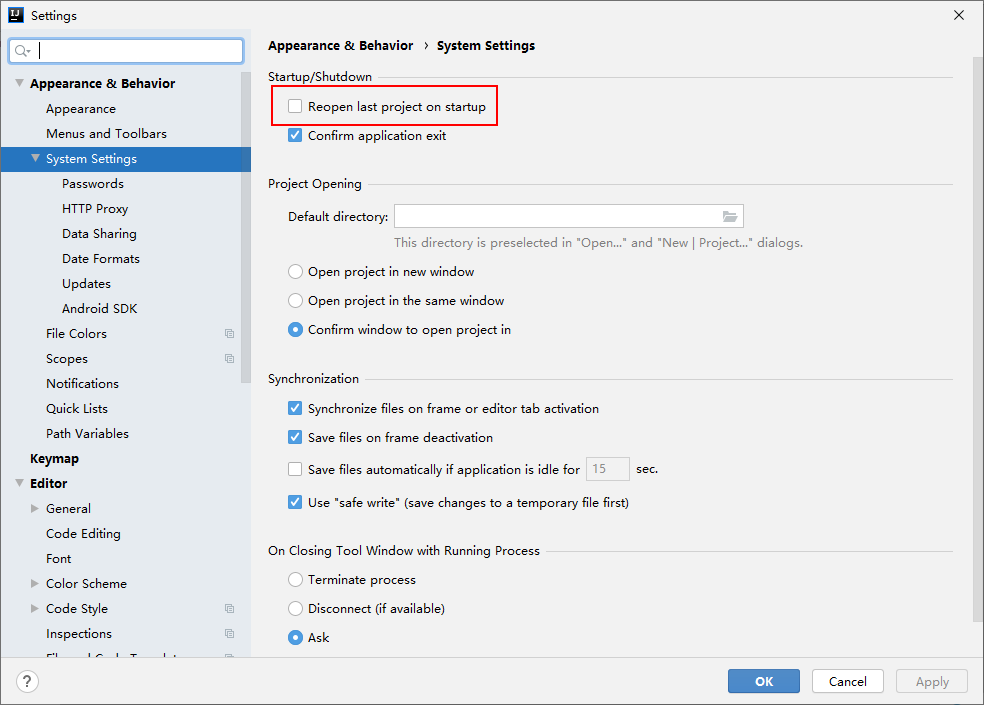


# 配置自动编译

> 当在调用/运行时修改文件后让其自动编译修改的文件

```java
File -> New Projects Settings -> Settings for New Projects... -> Build,Execution,Deployment -> Compiler（对所有新建项目有效）
File -> Settings... -> Build,Execution,Deployment -> Compiler（仅对当前本项目有效）
```

> 勾选 Build project automatically

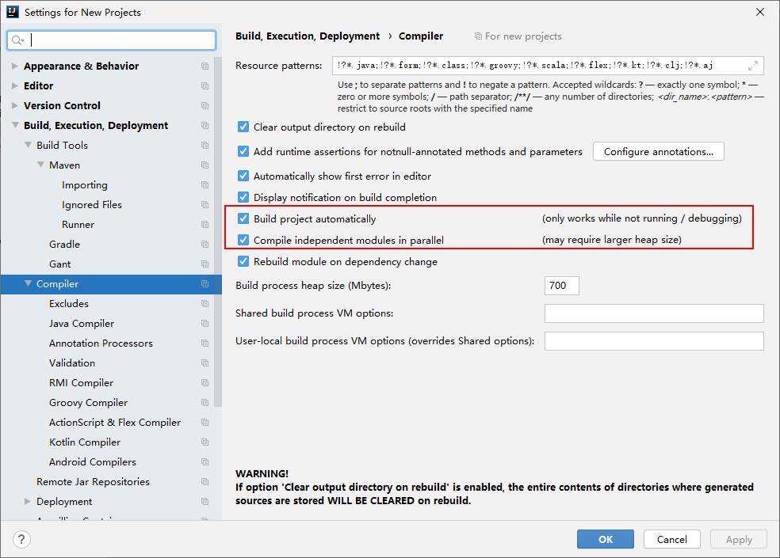


# 配置编译注解处理

> Lombok 需要对此选项设置

```java
File -> New Projects Settings -> Settings for New Projects... -> Build,Execution,Deployment -> Compiler -> Annotation Processors（对所有新建项目有效）
File -> Settings... -> Build,Execution,Deployment -> Compiler -> Annotation Processors（仅对当前本项目有效）
```

> 勾选 Enable annotaion processing

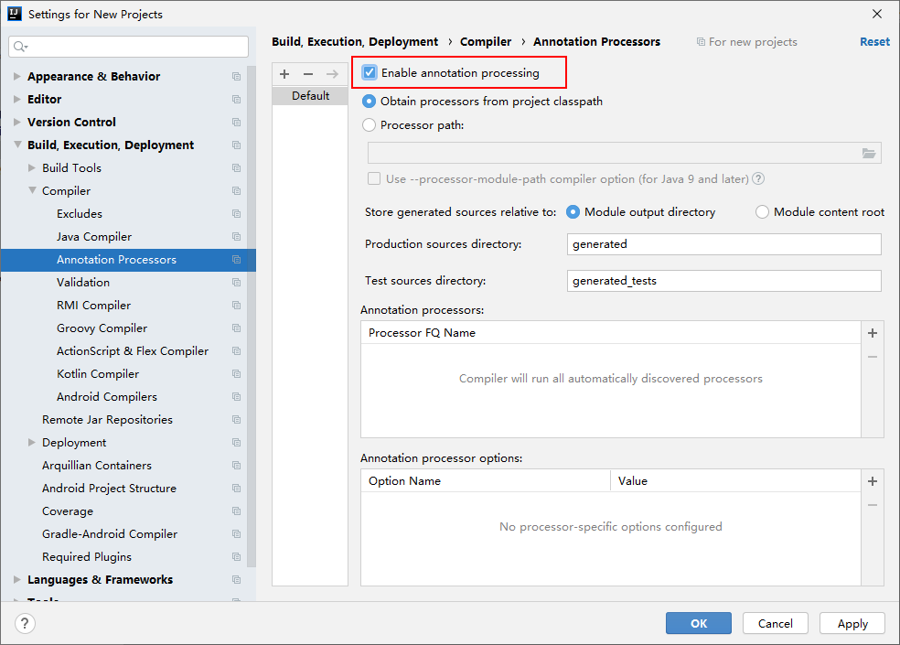


# 配置文件换行

>设置文件换行分隔符
>
>设置文件行超过指定列宽时自动换行

```java
File -> New Projects Settings -> Settings for New Projects... -> Editor -> Code Style （对所有新建项目有效）
File -> Settings... -> Editor -> Code Style（仅对当前本项目有效）
```

> 将 Line separator 选项改为 Unix and macOS (\n)
>
> 勾选 Wrap on typing

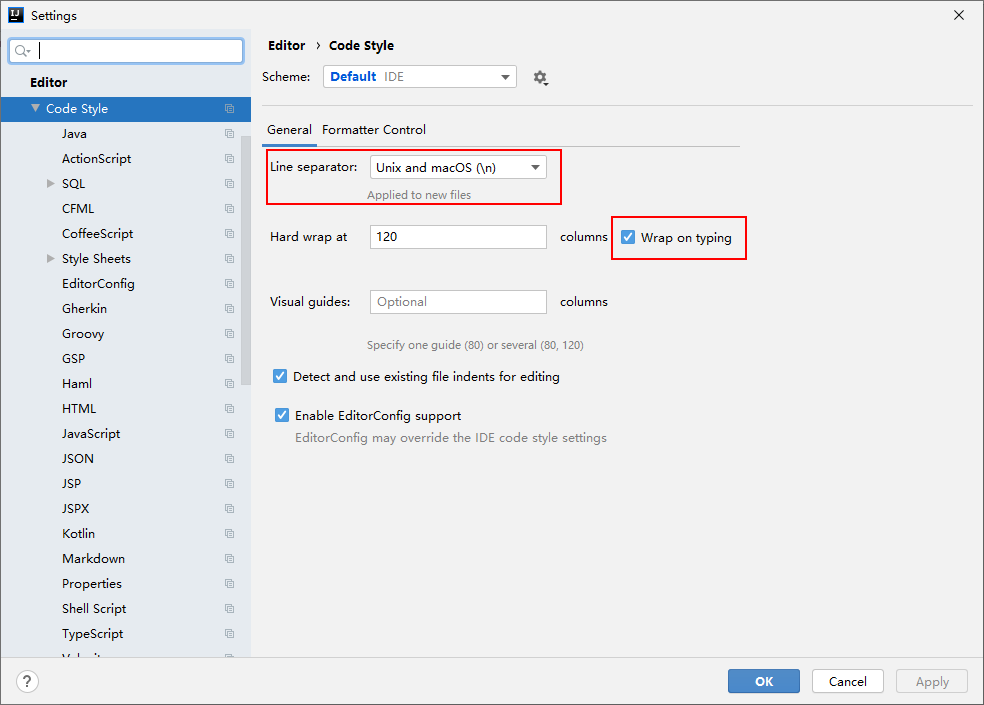


# 配置文件编码

```java
File -> New Projects Settings -> Settings for New Projects... -> Editor -> File Encodings （对所有新建项目有效）
File -> Settings... -> Editor -> Editor -> File Encodings（仅对当前本项目有效）
```

> 将 Global Encoding 选项值设置为 UTF-8
>
> 将 Project Encoding 选项值设置为 UTF-8
>
> 将 Default encoding for properties files 项目值设置为 UTF-8
>
> 勾选 Transparent native-to-ascii conversion

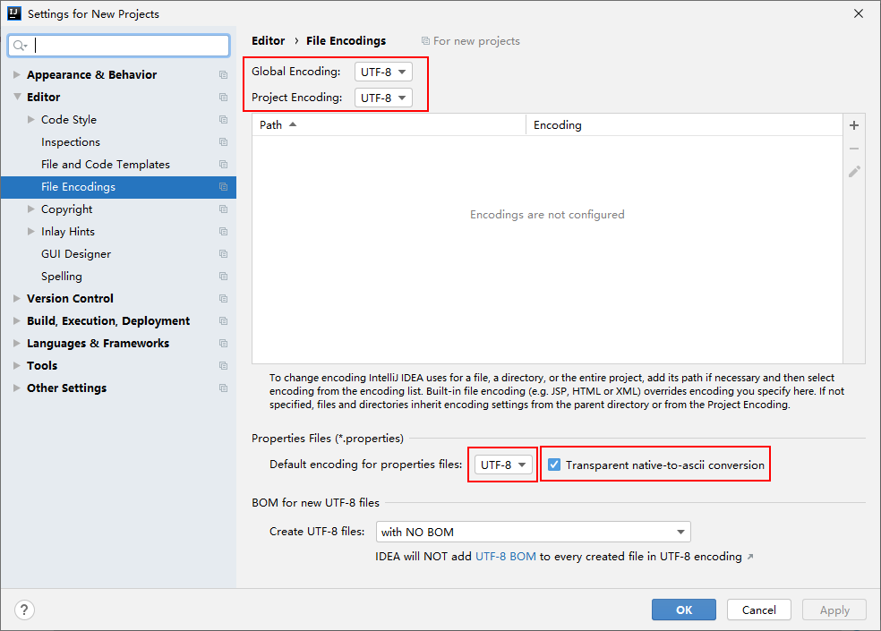


# 配置 Java 包导入

```java
File -> New Projects Settings -> Settings for New Projects... -> Editor -> Code Style -> Java -> Imports （对所有新建项目有效）
File -> Settings... -> Editor -> Code Style -> Java -> Imports（仅对当前本项目有效）
```

> 不让 Java 包导入时，导入 * 格式，以满足规范
>
> 勾选 User single class import
>
> 将 xxx import with '*' 改为 100 或更大

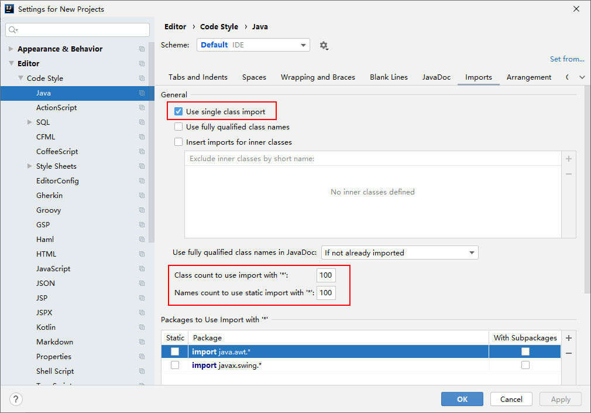


# 配置编辑器标签

```java
File -> Settings... -> Editor -> General -> Editor Tabs
```

> 取消勾选 Show tabs in one row，设置为多行标签
>
> 勾选 Mark modified (*)，设置修改过的在标签上标记星号显示
>
> Tab limit 的值调用为 50 或用户认为合适的值，设置标签最大限值

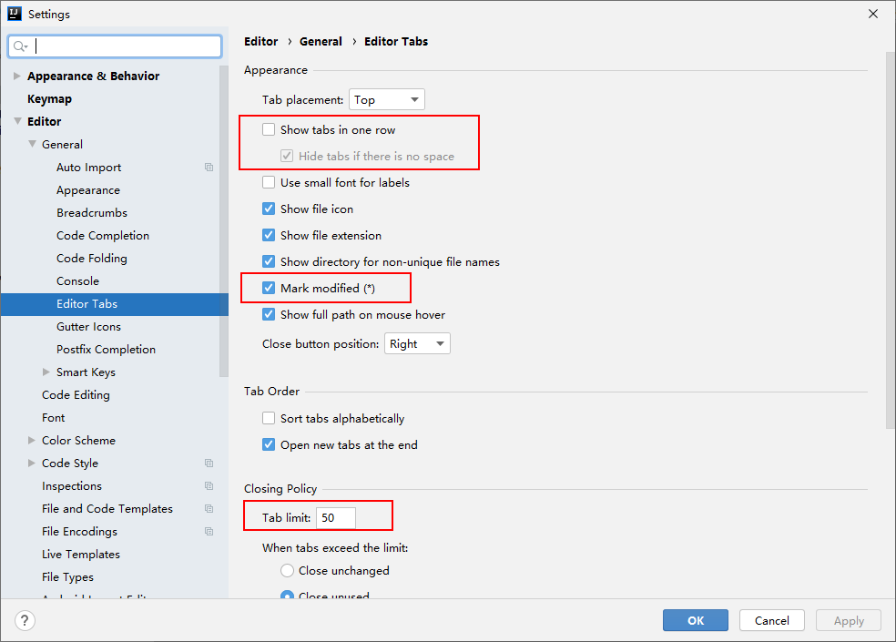


# 配置不显示文件

```java
File -> Settings... -> Editor -> File Types
```

> 在 Ignore files and folders 值框中配置不要在 IDEA 中显示的文件或文件夹，多少以英文分号分隔

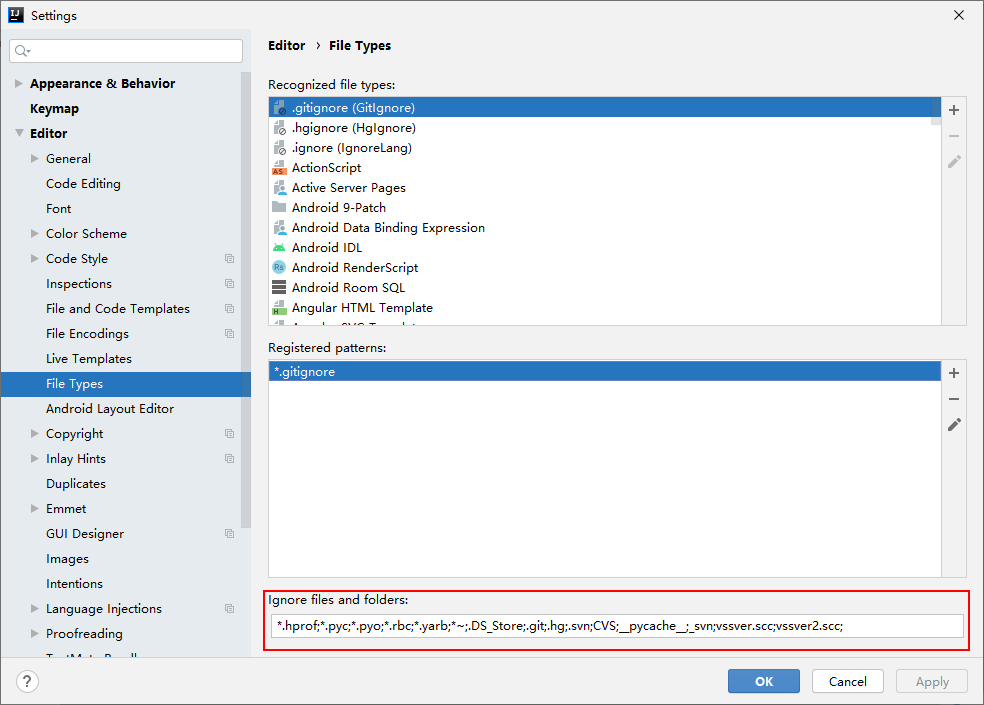


# 配置编辑器字体

```java
File -> Settings... -> Editor -> Font
```

> Font 选项可选择合适字体设置
>
> Size 设置字本大小为 16 或 设置认为合适的字体大小

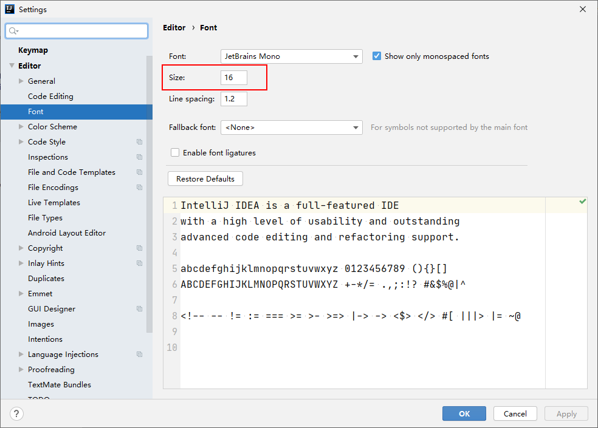


# 配置自动导入

```java
File -> New Projects Settings -> Settings for New Projects... -> Other Settings -> Auto Import（对所有新建项目有效）
File -> Settings... -> Editor -> General -> Auto Import（仅对当前本项目有效）
```

> 勾选 Add unambiguous imports on the fly
>
> 勾选 Optimize imports on the fly (for current project)

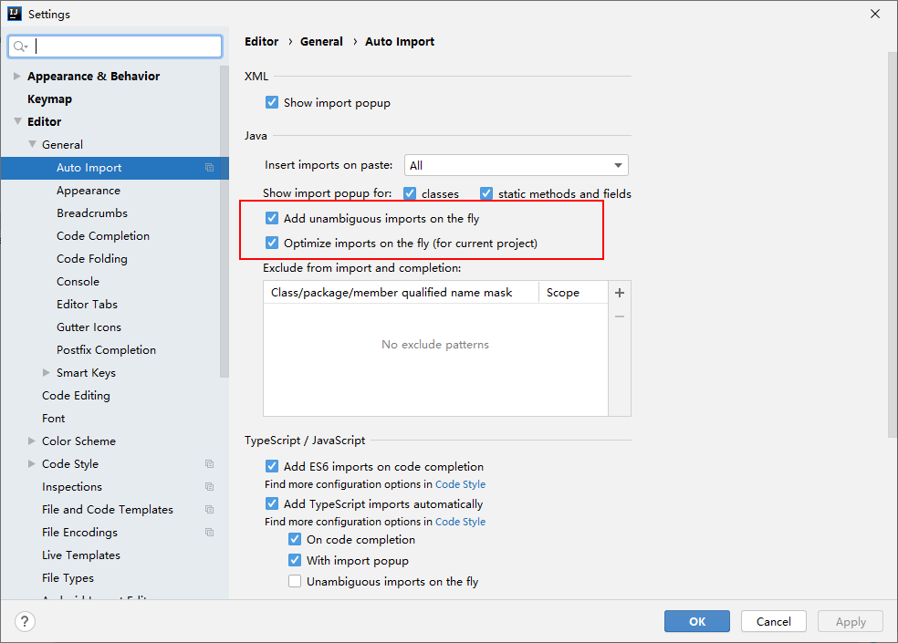


# 配置代码补全不大小区分

```java
File -> Settings... -> Editor -> General -> Code Completion
```

> 取消勾选 Matach case，设置为不区分大小写

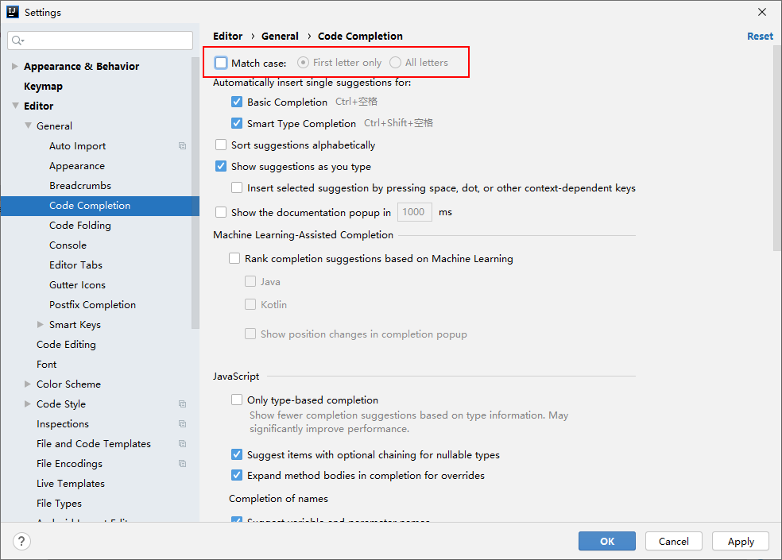


# 配置提醒 serialVersionUID 字段

```java
File -> New Projects Settings -> Settings for New Projects... -> Editor -> Inspections（对所有新建项目有效）
File -> Settings... -> Editor -> Inspections（仅对当前本项目有效）
```

> 不好找这个选项时，可以采用搜索 `serialVersionUID` 找到对应的项目即可
>
> 勾选 Serializable class without 'serialVersionUID' 项目
>
> 如果没有 'serialVersionUID' 字段时 IDEA 会报警告提示，在警告提示处理按 Alt + Enter 快捷快生成  'serialVersionUID'  字段

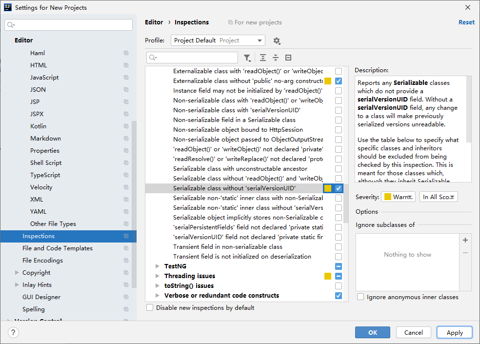


# 配置代码补全快捷键

```java
File -> Settings... -> Keymap
```

> Code -> Code Completion -> Basic 默认快捷键是 Ctrl+空格 有冲突
>
> 这里将 Basic 的快捷键添加一个 Alt+/ 并将 Cyclic Expand Word 的快捷键删除

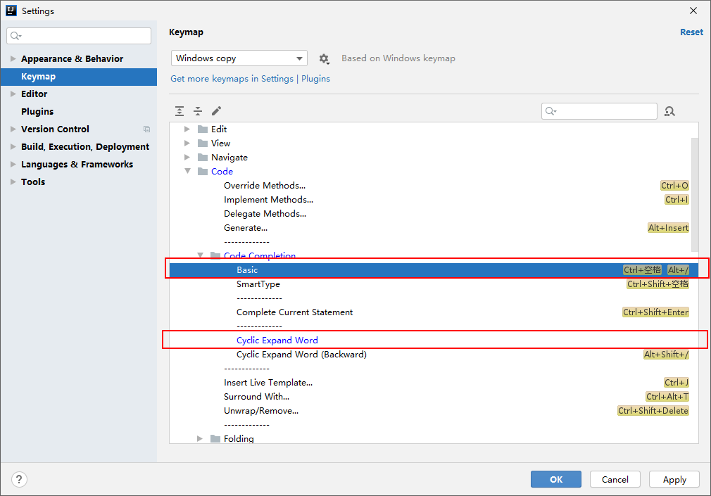


# 配置 SSH 终端编码

```java
File -> New Projects Settings -> Settings for New Projects... -> Tools -> SHH Terminal（对所有新建项目有效）
File -> Settings... -> Tools -> SHH Terminal（仅对当前本项目有效）
```

> 将 Default encoding 选项值设置为 UTF-8

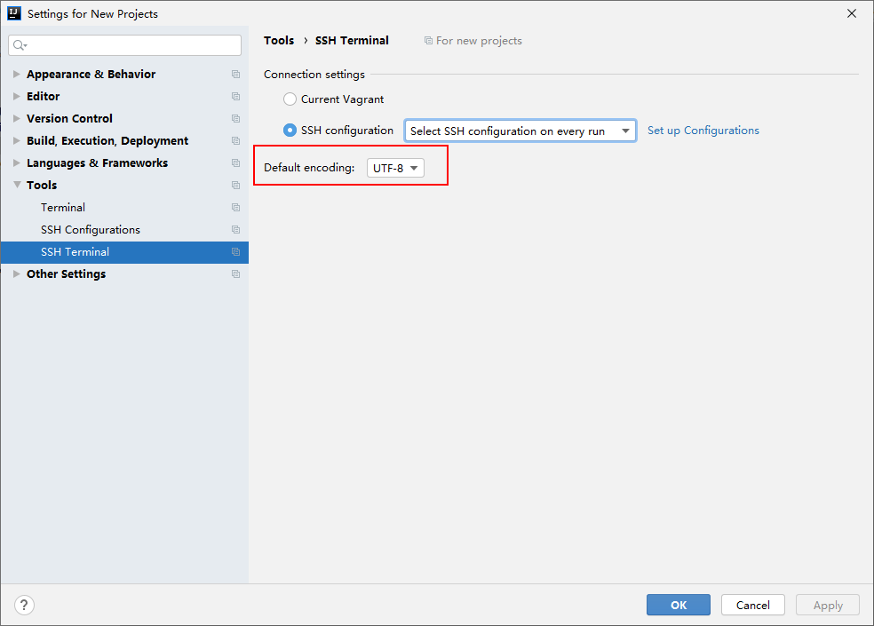


# 配置提交代码前优化包导入

```java
File -> New Projects Settings -> Settings for New Projects... -> Version Control -> Commit（对所有新建项目有效）
File -> Settings... -> Version Control -> Commit（仅对当前本项目有效）
```

> 勾选 Optimize imports

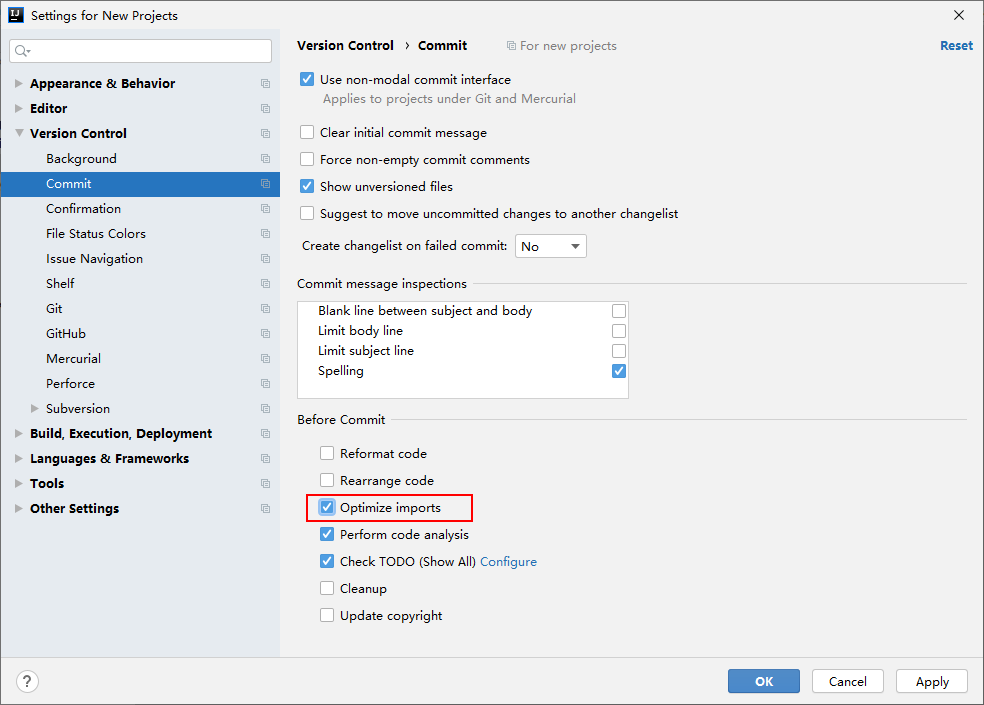


# 配置内存显示器

```java
View -> Appearance -> Status Bar Widgets
```

> 勾选 Memory Indicator

