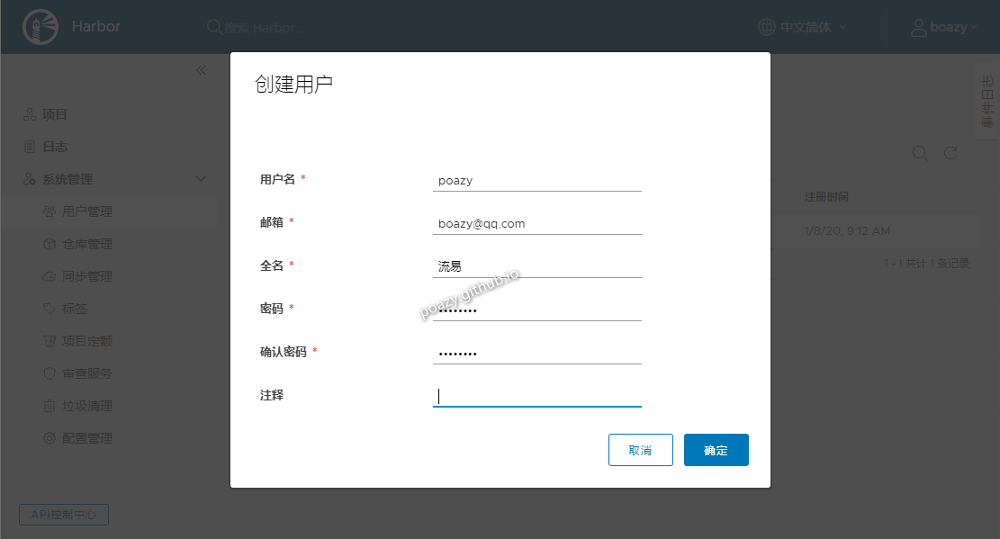
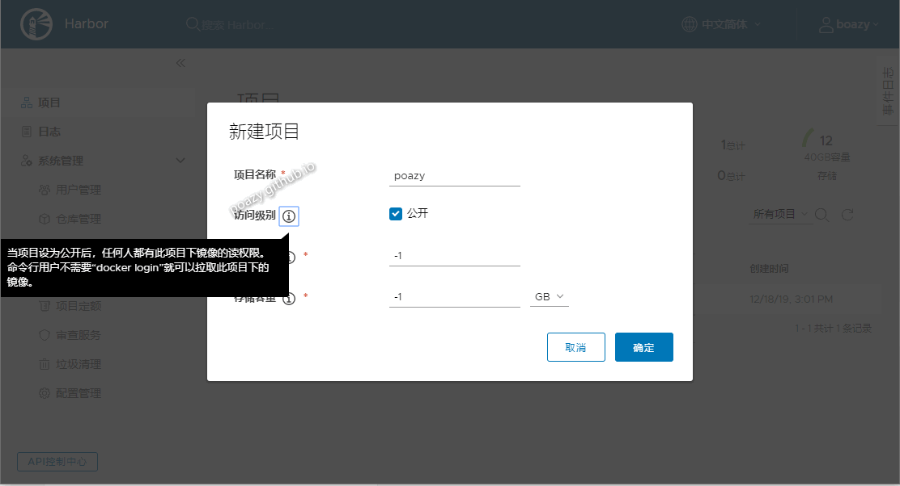

* content
{:toc}
> 记录使用 `Harbor` ，创建 `用户`、`项目` ，上传镜像，拉取镜像。


# 创建用户和项目

## 创建用户




## 创建项目




# 推拉镜像

## docker 登陆

* 上传镜像要先登陆的

1）首次登陆出错，需要设置

```bash
# 登陆 harbor，输入用户名和密码
docker login 192.168.9.241:8082
```

```
# 执行过程及结果
[root@centos7-qscft ~]# docker login 192.168.9.241:8082
Username: admin
Password:
Error response from daemon: Get https://192.168.9.241:8082/v2/: http: server gave HTTP response to HTTPS client
```

2）设置 `insecure-registries` 属性

* docker 高版本（目前的版本）设置方法

```bash
# 编辑 daemon.json 添加 "insecure-registries": ["192.168.9.241:8082"] 属性值
vi /etc/docker/daemon.json
```

```
# 执行过程及结果
[root@centos7-qscft ~]# vi /etc/docker/daemon.json
[root@centos7-qscft ~]# cat /etc/docker/daemon.json
{
  "registry-mirrors": ["https://xxx.mirror.aliyuncs.com"],
  "insecure-registries": ["192.168.9.241:8082"]
}
[root@centos7-qscft ~]#
```

* docker 1.7.1 低版本设置方法

```bash
# 编辑 docker 添加 --insecure-registry=192.168.9.241:8082 参数
vi /etc/sysconfig/docker
```

```
# 执行过程及结果
[root@platform-bak ~]# vi /etc/sysconfig/docker
[root@platform-bak ~]# cat /etc/sysconfig/docker
# /etc/sysconfig/docker
#
# Other arguments to pass to the docker daemon process
# These will be parsed by the sysv initscript and appended
# to the arguments list passed to docker -d

other_args="--registry-mirror=https://xxx.mirror.aliyuncs.com --insecure-registry=192.168.9.241:8082"
[root@platform-bak ~]# 
```

3）修改配置后重启 docker（并保证 harbor 正常启动）

```bash
systemctl restart docker
```

4）再登陆，登陆成功

```bash
# 登陆 harbor，输入用户名和密码
docker login 192.168.9.241:8082
```

```
# 登陆过程及结果
[root@centos7-qscft ~]# docker login 192.168.9.241:8082
Username: boazy
Password:
WARNING! Your password will be stored unencrypted in /root/.docker/config.json.
Configure a credential helper to remove this warning. See
https://docs.docker.com/engine/reference/commandline/login/#credentials-store

Login Succeeded
[root@centos7-qscft ~]# 
```

```
# 登陆成功后机器上会记录登陆的凭证（有有效期的）
[root@centos7-qscft ~]# cat ~/.docker/config.json
{
        "auths": {
                "192.168.9.241:8082": {
                        "auth": "Ym9hen************g="
                }
        },
        "HttpHeaders": {
                "User-Agent": "Docker-Client/19.03.5 (linux)"
        }
}
[root@centos7-qscft ~]# pwd
/root
[root@centos7-qscft ~]#
```

## 推拉镜像

1）查看镜像（选择 `xuxueli/xxl-job-admin:2.1.2` 镜像作试验）

```
[root@centos7-qscft ~]# docker images
REPOSITORY                                  TAG                              IMAGE ID            CREATED             SIZE
mysql                                       8.0.18                           ed1ffcb5eff3        10 days ago         456MB
jenkins/jenkins                             2.210                            5810ec636c04        2 weeks ago         582MB
xuxueli/xxl-job-admin                       2.1.2                            cfe34e8d6785        3 weeks ago         227MB
gitlab/gitlab-ce                            12.5.4-ce.0                      0f070900f085        4 weeks ago         1.82GB
goharbor/redis-photon                       v1.10.0                          6df66e5c1ca7        4 weeks ago         111MB
goharbor/harbor-registryctl                 v1.10.0                          c550280445e6        4 weeks ago         104MB
goharbor/registry-photon                    v2.7.1-patch-2819-2553-v1.10.0   2115e08fa399        4 weeks ago         86.5MB
goharbor/nginx-photon                       v1.10.0                          f7ed614c3abc        4 weeks ago         44MB
goharbor/harbor-log                         v1.10.0                          fb15f6772e9a        4 weeks ago         82.3MB
goharbor/harbor-jobservice                  v1.10.0                          d6d4f2b125f6        4 weeks ago         142MB
goharbor/harbor-core                        v1.10.0                          f3a3065b3af2        4 weeks ago         128MB
goharbor/harbor-portal                      v1.10.0                          fbaeb1fdacad        4 weeks ago         52.1MB
goharbor/harbor-db                          v1.10.0                          634404a417cf        4 weeks ago         148MB
goharbor/prepare                            v1.10.0                          927062458494        4 weeks ago         149MB
sonatype/nexus3                             3.19.1                           8eb898be2a53        3 months ago        611MB
caryyu/xxl-job-executor-sample-springboot   latest                           cf122b1859a2        13 months ago       464MB
[root@centos7-qscft ~]#
```

2）推拉镜像

```bash
# 打标签
docker tag xuxueli/xxl-job-admin:2.1.2 192.168.9.241:8082/poazy/xxl-job-admin:2.1.2
# 上传（推送）镜像（要登陆的）
docker push 192.168.9.241:8082/poazy/xxl-job-admin:2.1.2
# 删除刚才打的 tag 镜像
docker rmi 192.168.9.241:8082/poazy/xxl-job-admin:2.1.2
# 从 harbor 上拉取镜像
docker pull 192.168.9.241:8082/poazy/xxl-job-admin:2.1.2
```

```
# 执行过程及结果
[root@centos7-qscft ~]# docker tag xuxueli/xxl-job-admin:2.1.2 192.168.9.241:8082/poazy/xxl-job-admin:2.1.2
[root@centos7-qscft ~]# docker push 192.168.9.241:8082/poazy/xxl-job-admin:2.1.2
The push refers to repository [192.168.9.241:8082/poazy/xxl-job-admin]
bb08c9f93966: Layer already exists
bf8185dc9cb0: Layer already exists
3b545dd78a02: Layer already exists
3b6c930e22a7: Layer already exists
9fed13e1878e: Layer already exists
0c4ad05a0283: Layer already exists
dbf4cf3850fd: Layer already exists
2.1.2: digest: sha256:c72604c8357dd9fbba823f04878be2a7b8bc77cef1e51e8007ee02ec72d9bb59 size: 1784
[root@centos7-qscft ~]# docker rmi 192.168.9.241:8082/poazy/xxl-job-admin:2.1.2
Untagged: 192.168.9.241:8082/poazy/xxl-job-admin:2.1.2
Untagged: 192.168.9.241:8082/poazy/xxl-job-admin@sha256:c72604c8357dd9fbba823f04878be2a7b8bc77cef1e51e8007ee02ec72d9bb59
[root@centos7-qscft ~]# docker pull 192.168.9.241:8082/poazy/xxl-job-admin:2.1.2
2.1.2: Pulling from poazy/xxl-job-admin
Digest: sha256:c72604c8357dd9fbba823f04878be2a7b8bc77cef1e51e8007ee02ec72d9bb59
Status: Downloaded newer image for 192.168.9.241:8082/poazy/xxl-job-admin:2.1.2
192.168.9.241:8082/poazy/xxl-job-admin:2.1.2
[root@centos7-qscft ~]#
```


