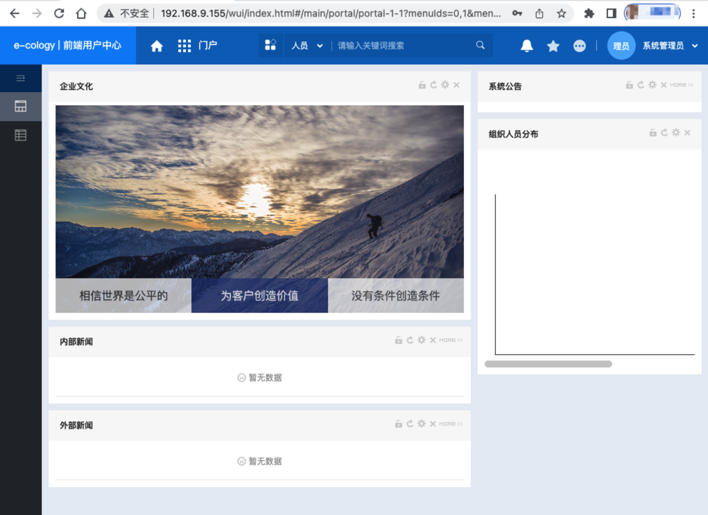
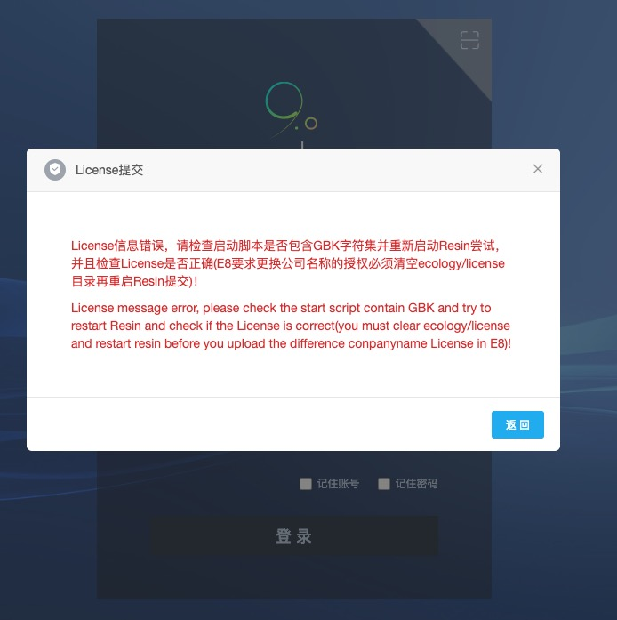

* content
{:toc}
> 本地环境基于 Resin 和 MySQL 部署 E9（Ecology9）应用。


------

## 安装 MySQL 数据库

### 运行 MySQL 镜像

* character-set-server、collation-server、group_concat_max_len、log_bin_trust_function_creators、lower_case_table_names、max_connections、transaction_isolation、sql_mode 参数必须设定值，否则 e9 初始化会出错（非常重要）
* https://blog.csdn.net/fwecology/article/details/123341045

```bash
### 运行命令（按配置参数）安装 MySQL
sudo docker run -d --restart=always --name mysql-e9 \
	-p 3326:3306 \
	-v /poazy/data/dockerdata/mysql-e9/data:/var/lib/mysql \
	-v /poazy/data/dockerdata/mysql-e9/log:/var/log/mysql \
  -v /etc/localtime:/etc/localtime:ro \
	-e "TZ=Asia/Shanghai" \
	-e MYSQL_ROOT_PASSWORD=mysq@l123 \
	mysql/mysql-server:8.0.19 \
	--character-set-server=utf8 --collation-server=utf8_general_ci \
	--group_concat_max_len=102400 --log_bin_trust_function_creators=1 \
	--lower_case_table_names=1 --max_connections=5000 \
	--transaction_isolation=READ-COMMITTED \
	--sql_mode=STRICT_TRANS_TABLES,NO_ENGINE_SUBSTITUTION \
	--max_connect_errors=1000
```

```bash
[root@localhost dockerdata]# sudo docker run -d --restart=always --name mysql-e9 \
> -p 3326:3306 \
> -v /poazy/data/dockerdata/mysql-e9/data:/var/lib/mysql \
> -v /poazy/data/dockerdata/mysql-e9/log:/var/log/mysql \
>   -v /etc/localtime:/etc/localtime:ro \
> -e "TZ=Asia/Shanghai" \
> -e MYSQL_ROOT_PASSWORD=mysq@l123 \
> mysql/mysql-server:8.0.19 \
> --character-set-server=utf8 --collation-server=utf8_general_ci \
> --group_concat_max_len=102400 --log_bin_trust_function_creators=1 \
> --lower_case_table_names=1 --max_connections=5000 \
> --transaction_isolation=READ-COMMITTED \
> --sql_mode=STRICT_TRANS_TABLES,NO_ENGINE_SUBSTITUTION \
> --max_connect_errors=1000
2617f403e879a2e03cc1ed286aa8cbbb92b49c083ba12a1623c21f2cd6bb8588
[root@localhost dockerdata]# docker ps |grep mysql-e9
2617f403e879   mysql/mysql-server:8.0.19                 "/entrypoint.sh --ch…"   About a minute ago   Up About a minute (healthy)   33060/tcp, 0.0.0.0:3326->3306/tcp, :::3326->3306/tcp                                                                                      mysql-e9
[root@localhost dockerdata]# 
```

### 配置 MySQL

* 避免后面使用遇到一些错误

```bash
### 连接数据库
docker exec -it mysql-e9 mysql -u root -p
### 输入密码

### 查询参数值
###（ 值非常重要，e9 初始化会出错错误：Error executing 'CALL mysql_e9_para_change() ' (line 47): Table 'ecology.e9_para_lower_case_table_names' doesn't exist ）
show variables where variable_name in (
    'log_bin_trust_function_creators'
    ,'transaction_isolation'
    ,'lower_case_table_names'
    ,'sql_mode'
    ,'character_set_server'
    ,'default_character_set'
    ,'max_connections'
    ,'innodb_buffer_pool_size'
    ,'group_concat_max_len'
    );
+---------------------------------+--------------------------------------------+
| Variable_name                   | Value                                      |
+---------------------------------+--------------------------------------------+
| character_set_server            | utf8                                       |
| group_concat_max_len            | 102400                                     |
| innodb_buffer_pool_size         | 134217728                                  |
| log_bin_trust_function_creators | ON                                         |
| lower_case_table_names          | 1                                          |
| max_connections                 | 5000                                       |
| sql_mode                        | STRICT_TRANS_TABLES,NO_ENGINE_SUBSTITUTION |
| transaction_isolation           | READ-COMMITTED                             |
+---------------------------------+--------------------------------------------+
8 rows in set (0.01 sec)

### 切换为 mysql 库
use mysql;
### 设置远程访问
### 1130-host '172.0.0.1' is not allowed to connect to this MySql server
### https://blog.csdn.net/h996666/article/details/80921913
grant all privileges on *.* to 'root'@'%';

### ERROR 1410 (42000): You are not allowed to create a user with GRANT
update user set host='%' where user='root';
### 再执行两次命令（第一次还是会报错，第二次就 OK 了）：
grant all privileges on *.* to 'root'@'%';

### 查询加密方式
select Host,User,plugin from user;
+-----------+------------------+-----------------------+
| Host      | User             | plugin                |
+-----------+------------------+-----------------------+
| %         | root             | caching_sha2_password |
| localhost | mysql.infoschema | caching_sha2_password |
| localhost | mysql.session    | caching_sha2_password |
| localhost | mysql.sys        | caching_sha2_password |
| localhost | root             | caching_sha2_password |
+-----------+------------------+-----------------------+
5 rows in set (0.00 sec)
### 修改为 mysql_native_password 
### 2059 - Authentication plugin 'caching_sha2_password' cannot be loaded:...'
### java.sql.SQLException: Unable to load authentication plugin 'caching_sha2_password'.
alter user 'root'@'%' identified with mysql_native_password by 'mysq@l123';
### 查询加密方式
select Host,User,plugin from user;
+-----------+------------------+-----------------------+
| Host      | User             | plugin                |
+-----------+------------------+-----------------------+
| %         | root             | mysql_native_password |
| localhost | mysql.infoschema | caching_sha2_password |
| localhost | mysql.session    | caching_sha2_password |
| localhost | mysql.sys        | caching_sha2_password |
| localhost | root             | caching_sha2_password |
+-----------+------------------+-----------------------+
5 rows in set (0.00 sec)

### mysqladmin -u root -p flush-hosts
### 1129-host '172.0.0.1' is blocked because of many connection errors; unblock with ‘mysqladmin flush-hosts’
flush hosts;
### 查询 max_connect_errors 参数值
show variables like '%max_connect_errors%';
+--------------------+-------+
| Variable_name      | Value |
+--------------------+-------+
| max_connect_errors | 100   |
+--------------------+-------+
1 row in set (0.03 sec)
### 设置 max_connect_errors 参数值
show variables like '%max_connect_errors%';
+--------------------+-------+
| Variable_name      | Value |
+--------------------+-------+
| max_connect_errors | 1000  |
+--------------------+-------+
1 row in set (0.01 sec)
```

### 创建 E9 数据库

```bash
### 创建 ecology 数据库
create database ecology;
Query OK, 1 row affected (0.01 sec)
```


------

## 部署 E9（Ecology9） 

* Resin-4.0.58、Ecology9.00.2206.03

### 下载 Resin 和 Ecology

```bash
下载(install-> 安装包 -> Resin 目录下)：
链接: https://pan.baidu.com/s/1GHAPg4AASJ-3u_YcciQWtQ
密码: sl3i
```

### 解压  Resin 和 Ecology

```bash
cd /Users/duanbo/devops/weaver
unzip Resin-4.0.58.zip
unzip Ecology9.00.2206.03.zip
```

```bash
duanbo@duanbo-mbp weaver % ls -lh
-rw-r--r--@   1 duanbo  staff   2.7G Sep 29 10:36 Ecology9.00.2206.03.zip
-rw-r--r--@   1 duanbo  staff    73M Sep 29 11:39 Resin-4.0.58.zip
drwxr-xr-x@  45 duanbo  staff   1.4K Sep 29 12:12 Resin4
drwxr-xr-x@ 232 duanbo  staff   7.3K Sep 29 11:46 ecology
duanbo@duanbo-mbp weaver % 
```

### 授权 Resin 目录

```bash
chmod +x resin4
```

### 配置 Resion

#### resin.sh

* 修改 JAVA_HOME
* 添加 ulimit、LC_ALL、LANG 配置

```bash
vi /Users/duanbo/devops/weaver/Resin4/bin/resin.sh
```

```bash
# To install, you'll need to configure JAVA_HOME and RESIN_HOME and
# copy contrib/init.resin to /etc/rc.d/init.d/resin.  Then
# use "unix# /sbin/chkconfig resin on"

JAVA_HOME=/Library/Java/JavaVirtualMachines/jdk1.8.0_202.jdk/Contents/Home
export JAVA_HOME
ulimit -n 65535
export LC_ALL=zh_CN.gbk
export LANG=zh_CN.gbk

```

#### resin.properties

* 可根据情况调 端口、JVM参数，这里不调整

```bash
vi /Users/duanbo/devops/weaver/Resin4/conf/resin.properties
```

```bash

```

#### resin.xml

* 调整  java 标签 的 compiler 属性值和 web-app 标签的 root-directory 属性值

```bash
vi /Users/duanbo/devops/weaver/Resin4/conf/resin.xml
```

```bash
	 <!--
     - You can change the compiler to "javac", "eclipse" or "internal".
    -->
   <javac compiler="/Library/Java/JavaVirtualMachines/jdk1.8.0_202.jdk/Contents/Home/bin/javac" args="-encoding UTF-8"/>
```

```bash
		  <!--
         - webapps can be overridden/extended in the resin.xml
        -->
      <web-app id="/" root-directory="/Users/duanbo/devops/weaver/ecology">
				<servlet-mapping url-pattern='/weaver/*' servlet-name='invoker'/>
				<form-parameter-max>100000</form-parameter-max>
      </web-app>
```

### 启动 Resion

```bash
sh /Users/duanbo/devops/weaver/Resin4/bin/resin.sh start
sh /Users/duanbo/devops/weaver/Resin4/bin/resin.sh stop
sh /Users/duanbo/devops/weaver/Resin4/bin/resin.sh restart
sh /Users/duanbo/devops/weaver/Resin4/bin/resin.sh status
```

```bash
duanbo@duanbo-mbp weaver % sh /Users/duanbo/devops/weaver/Resin4/bin/resin.sh start
Resin/4.0.58 launching watchdog at 127.0.0.1:6600
Resin/4.0.58 started -server 'app-0' with watchdog at 127.0.0.1:6600
duanbo@duanbo-mbp weaver %
```


------

## 访问 E9（Ecology9）

### 访问 E9

```bash
### 浏览器访问
http://192.168.9.155
```

### 初始化 E9 数据库

```bash
### 查询验证码
cat /Users/duanbo/devops/weaver/ecology/WEB-INF/code.key
```

```bash
duanbo@duanbo-mbp weaver % cat /Users/duanbo/devops/weaver/ecology/WEB-INF/code.key
wEAver2018                                                                                                                                                                                                                               
duanbo@duanbo-mbp weaver % 
```

* 初始化数据库有些久


### 重启 Resin

* 初始化成功后，重启 Resin

```bash
sh /Users/duanbo/devops/weaver/Resin4/bin/resin.sh restart
```
```bash
duanbo@duanbo-mbp weaver % sh /Users/duanbo/devops/weaver/Resin4/bin/resin.sh restart
Resin/4.0.58 restarted -server 'app-0' for watchdog at 127.0.0.1:6600
duanbo@duanbo-mbp weaver %
```

### 登入系统

```bash
地址：http://192.168.9.155
账号/密码：sysadmin/Weaver@2001
验证码：wEAver2018
license文件：【识别码发给厂商获取】
```





------

## 附录

### 错误记录

#### 初始化时数据库错误


* 看这个，就可以知道 MySQL 数据库的配置值要设置什么才能成功


#### License提交错误

* 按提示检查 ecology/license 下是否空，再重新上传提交




