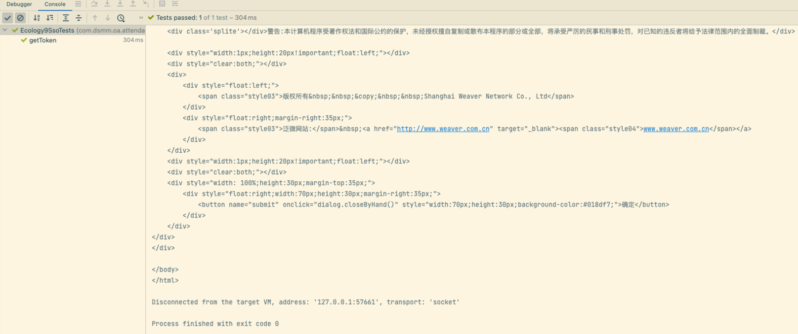

* content
{:toc}
> 第三方单点登陆 E9（Ecology9）单元测试用例。


------

## 配置 SSO

### 开启 Token 认证
```bash
后端应用中心 -> 集成中心 -> 认证服务管理 -> Token认证
```


### 注册应用 
```bash
后端应用中心 -> 集成中心 -> 认证服务管理 -> 认证应用管理
```
> 应用标识 和 应用密钥 也可以手工输入的


------

## 第三方 SSO 

### 访问页面（Java）

```java
package com.xxx.yyy.zzz.test;

import cn.hutool.http.HttpUtil;
import org.junit.Assert;
import org.junit.Test;

import java.util.HashMap;
import java.util.Map;

/**
 * 第三方单点登录Ecology
 *
 * @author duanbo
 * @since 2022-10-04
 */
public class Ecology9SsoTests {

    @Test
    public void getToken() {
        // 1获取 token
        String getTokenUrl = "http://192.168.9.155:80/ssologin/getToken";
        Map<String, Object> params1 = new HashMap<>();
        params1.put("appid", "87adadba-cb91-49e0-a50e-06312235a37c"); // 应用标识
        params1.put("loginid", "sysadmin"); // 用户名（与 账号映射规则 有关）
        String token = HttpUtil.post(getTokenUrl, params1);
        System.out.println("");
        System.out.println("Token 结果：" + token);
        System.out.println("");

        // 2检验 token
        String checkUrl = "http://192.168.9.155:80/ssologin/checkToken";
        Map<String, Object> params2 = new HashMap<>();
        params2.put("token", token); // Token
        String checkResult = HttpUtil.post(checkUrl, params2);
        System.out.println("检验结果：" + checkResult);
        System.out.println("");
        Assert.assertEquals("true", checkResult);

        // 3单点登陆访问 Ecology 页面
        String visitUrl = "http://192.168.9.155:80/systeminfo/version.jsp";
        Map<String, Object> params3 = new HashMap<>();
        params3.put("ssoToken", token); // Token
        String visitResult = HttpUtil.post(visitUrl, params3);
        System.out.println(visitResult); // 返回访问内容
        System.out.println("");
        Assert.assertNotNull(visitResult);
        Assert.assertTrue(visitResult.contains(">版本:&nbsp;9"));
        Assert.assertTrue(visitResult.contains(">授权用户:&nbsp;"));
    }

}
```


### 访问页面（HTTP）

* 样例1（请生成新的 ssoToken 再访问）

```bash
http://192.168.9.155/ssologin/getToken?appid=87adadba-cb91-49e0-a50e-06312235a37c&loginid=sysadmin
```

```bash
http://192.168.9.155/ssologin/checkToken?token=BBDB12ACF41A1EBD2FF3DED4FAB2E439A29919CB40915FF6E5F38B48C099E4B609C5978AE9023F2E4A4601E036683F461B29725790826E9FA9F61329BD4FE651
```

```bash
http://192.168.9.155/wui/index.html?ssoToken=BBDB12ACF41A1EBD2FF3DED4FAB2E439A29919CB40915FF6E5F38B48C099E4B609C5978AE9023F2E4A4601E036683F461B29725790826E9FA9F61329BD4FE651#/main
```

* 样例2（请生成新的 ssoToken 再访问）

```bash
http://192.168.9.155/ssologin/getToken?appid=87adadba-cb91-49e0-a50e-06312235a37c&loginid=sysadmin
```

```bash
http://192.168.9.155/ssologin/checkToken?token=BBDB12ACF41A1EBD2FF3DED4FAB2E43983ABF8671D96D4DA496800D18B865F3509C5978AE9023F2E4A4601E036683F461B29725790826E9FA9F61329BD4FE651
```

```bash
http://192.168.9.155/ecode?ssoToken=BBDB12ACF41A1EBD2FF3DED4FAB2E43983ABF8671D96D4DA496800D18B865F3509C5978AE9023F2E4A4601E036683F461B29725790826E9FA9F61329BD4FE651#/main
```

