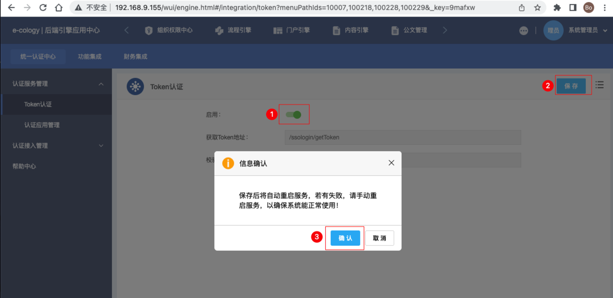
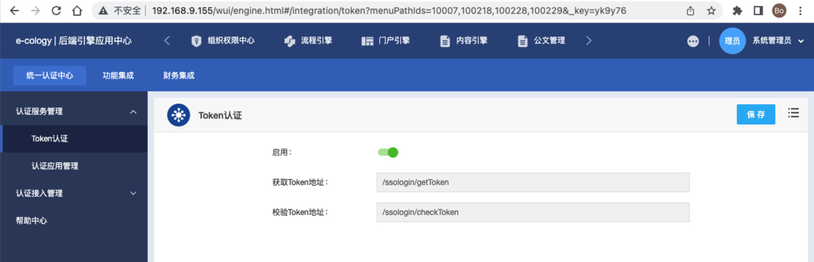
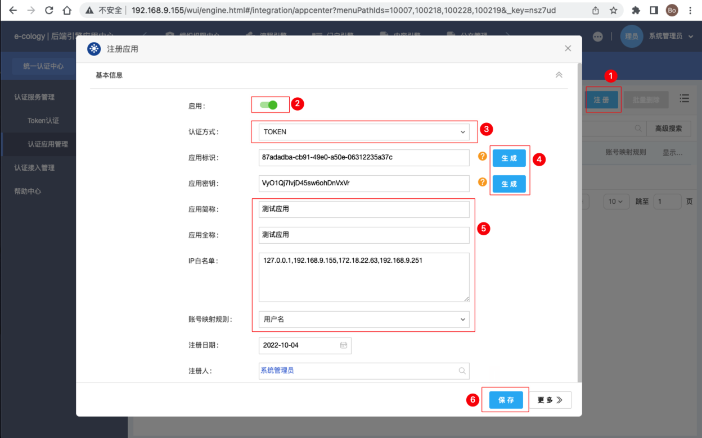
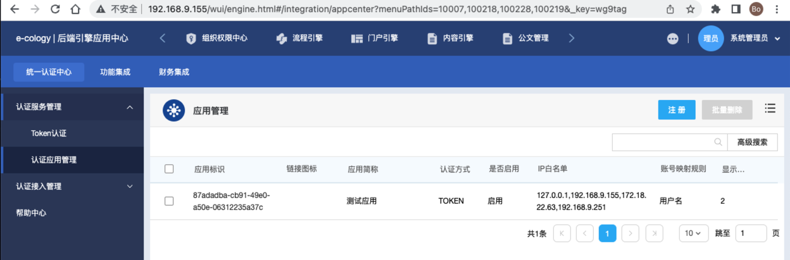

* content
{:toc}
> 第三方单点登陆 E9（Ecology9）单元测试用例。


------

## 配置 SSO

### 开启 Token 认证
```bash
后端应用中心 -> 集成中心 -> 认证服务管理 -> Token认证
```



### 注册应用 
```bash
后端应用中心 -> 集成中心 -> 认证服务管理 -> 认证应用管理
```
> 应用标识 和 应用密钥 也可以手工输入的





------

## 第三方 SSO 

### 访问页面（Java）

```java
package com.xxx.yyy.zzz.test;

import cn.hutool.http.HttpUtil;
import org.junit.Assert;
import org.junit.Test;

import java.util.HashMap;
import java.util.Map;

/**
 * 第三方单点登录Ecology
 *
 * @author duanbo
 * @since 2022-10-04
 */
public class Ecology9SsoTests {

    @Test
    public void getToken() {
        // 1获取 token
        String getTokenUrl = "http://192.168.9.155:80/ssologin/getToken";
        Map<String, Object> params1 = new HashMap<>();
        params1.put("appid", "87adadba-cb91-49e0-a50e-06312235a37c"); // 应用标识
        params1.put("loginid", "sysadmin"); // 用户名（与 账号映射规则 有关）
        String token = HttpUtil.post(getTokenUrl, params1);
        System.out.println("");
        System.out.println("Token 结果：" + token);
        System.out.println("");

        // 2检验 token
        String checkUrl = "http://192.168.9.155:80/ssologin/checkToken";
        Map<String, Object> params2 = new HashMap<>();
        params2.put("token", token); // Token
        String checkResult = HttpUtil.post(checkUrl, params2);
        System.out.println("检验结果：" + checkResult);
        System.out.println("");
        Assert.assertEquals("true", checkResult);

        // 3单点登陆访问 Ecology 页面
        String visitUrl = "http://192.168.9.155:80/systeminfo/version.jsp";
        Map<String, Object> params3 = new HashMap<>();
        params3.put("ssoToken", token); // Token
        String visitResult = HttpUtil.post(visitUrl, params3);
        System.out.println(visitResult); // 返回访问内容
        System.out.println("");
        Assert.assertNotNull(visitResult);
        Assert.assertTrue(visitResult.contains(">版本:&nbsp;9"));
        Assert.assertTrue(visitResult.contains(">授权用户:&nbsp;"));
    }

}
```

```html

Token 结果：B55F56B924CDEC8E1C7BBACFD9CBA690539FC8D240A6C5D9A6CC7EB79FBB780009C5978AE9023F2E4A4601E036683F461B29725790826E9FA9F61329BD4FE651

检验结果：true
 

<!DOCTYPE HTML>


<html>
<head>
    <!--
    添加至init.css
    <style type="text/css">
        html{height:100%;}
    </style>
     -->
    <script>window.ecologyContentPath='';</script>
    

    

    

    
    <script type="text/javascript" src="/cloudstore/resource/pc/jquery/jquery.min.js"></script>
    
    <script language="javascript" type="text/javascript" src="/FCKEditor/swfobject_wev8.js"></script>

    
    <!-- js 整合到 init_wev8.js -->
    <script type="text/javascript" src="/js/jquery.table_wev8.js"></script>
    <script language="javascript" type="text/javascript" src="/js/init_wev8.js"></script>
    <script language="javascript" src="/js/wbusb_wev8.js"></script>
    <script type="text/javascript" src="/js/jquery/plugins/client/jquery.client_wev8.js"></script>
    <script type="text/javascript" src="/js/ecology8/jNice/jNice/jquery.jNice_wev8.js"></script>
    <script type='text/javascript' src='/js/jquery-autocomplete/jquery.autocomplete_wev8.js'></script>
    <script type='text/javascript' src='/js/jquery-autocomplete/browser_wev8.js'></script>
    <script language=javascript src="/wui/theme/ecology8/jquery/js/zDialog_wev8.js?v=20200331"></script>
    <script type="text/javascript" src="/js/ecology8/request/hoverBtn_wev8.js"></script>
    <script type="text/javascript" src="/js/ecology8/lang/weaver_lang_7_wev8.js?v=1664847620328747075"></script>
    <script type="text/javascript" src="/js/messagejs/highslide/highslide-full_wev8.js"></script>
    <script type="text/javascript">
        hs.graphicsDir = '/js/messagejs/highslide/graphics/';
        hs.align = 'center';
        hs.transitions = ['expand', 'crossfade'];
        hs.outlineType = 'rounded-white';
        hs.fadeInOut = true;
    </script>
    <!-- init.css, 所有css文件都在此文件中引入 -->
    <link rel="stylesheet" href="/css/init_wev8.css" type="text/css"/>


    <script language=javascript>
        window["_jsessionid"] = "aaaeEQgGX1yTb4h7OPGoy";

        function check_conn() {
            return confirm('网络故障或其它原因导致您连接不上服务器，请复制下重要信息稍候再提交！\r\n\r\n按【确定】继续,按【取消】停留在本页!');
        }

        function _onViewLog(operateitem, sqlwhere, id) {
            if (!sqlwhere) sqlwhere = "";
            var dialog = new window.top.Dialog();
            dialog.currentWindow = window;
            dialog.Title = "查看日志";
            var url = "/docs/tabs/DocCommonTab.jsp?_fromURL=3&operateitem=" + operateitem + "&sqlwhere=" + sqlwhere;
            if (id) {
                url = "/docs/tabs/DocCommonTab.jsp?_fromURL=3&relatedid=" + id + "&operateitem=" + operateitem + "&sqlwhere=" + sqlwhere;
                if (operateitem == 418 || operateitem == 419 || operateitem == 420) {
                    dialog.Title = "变更日志";
                }
            }
            dialog.Width = jQuery(window).width();
            dialog.Height = 610;
            dialog.Drag = true;
            dialog.checkDataChange = false;
            dialog.maxiumnable = true;
            dialog.URL = url;
            dialog.show();
        }


        function check_form(thiswins, items) {
            /* added by cyril on 2008-08-14 for td:8521 */
            var isconn = false;
            try {
                var xmlhttp;
                if (window.XMLHttpRequest) {
                    xmlhttp = new XMLHttpRequest();
                }
                else if (window.ActiveXObject) {
                    xmlhttp = new ActiveXObject("Microsoft.XMLHTTP");
                }
                var URL = "/systeminfo/CheckConn.jsp?userid=1&time=" + new Date() + "&f_weaver_belongto_userid=1&f_weaver_belongto_usertype=0";
                xmlhttp.open("GET", URL, false);
                xmlhttp.send(null);
                var result = xmlhttp.status;
                if (result == 200) {
                    isconn = true;
                    var response_flag = xmlhttp.responseText;
                    if (response_flag != '0') {
                        var flag_msg = '';
                        if (response_flag == '1') {
                            var diag = new Dialog();
                            diag.Width = 300;
                            diag.Height = 180;
                            diag.ShowCloseButton = false;
                            diag.Title = "网页超时提醒";
                            //diag.InvokeElementId="pageOverlay"
                            diag.URL = "/wui/theme/ecology7/page/loginSmall.jsp";
                            diag.show();
                            return false;
                        }
                        else if (response_flag == '2') {
                            flag_msg = '网络故障或其它原因导致您连接不上服务器，请复制下重要信息稍候再提交！';
                        }
                        //主从帐户特殊处理 by alan for TD10156
                        if (response_flag == '3') {
                            flag_msg = '提交信息失败,该页面非当前帐号打开,请刷新页面后再提交!';

                            return false;
                        }
                        flag_msg += '\r\n\r\n按【确定】继续,按【取消】停留在本页!';
                        //alert(xmlhttp.responseText);
                        return confirm(flag_msg);
                    }
                }
                xmlhttp = null;

                //检查多行文本框 oracle下检查HTML不能超过4000个字符
                
            }
            catch (e) {
                return check_conn();
            }
            if (!isconn)
                return check_conn();
            /* end by cyril on 2008-08-14 for td:8521 */

            thiswin = thiswins
            items = "," + items + ",";

            var tempfieldvlaue1 = "";
            try {
                tempfieldvlaue1 = document.getElementById("htmlfieldids").value;
            } catch (e) {
            }

            for (i = 1; i <= thiswin.length; i++) {
                tmpname = thiswin.elements[i - 1].name;
                tmpvalue = thiswin.elements[i - 1].value;
                if (tmpvalue == null) {
                    continue;
                }

                if (tmpname != "" && items.indexOf("," + tmpname + ",") != -1) {
                    var __fieldhtmltype = jQuery("input[name=" + tmpname + "]").attr("__fieldhtmltype");
                    if (__fieldhtmltype == '9') {
                        continue;
                    }


                    var href = location.href;
                    if (href && href.indexOf("Ext.jsp") != -1) {
                        window.__oriAlert__ = true;
                    }
                    if (tempfieldvlaue1.indexOf(tmpname + ";") == -1) {
                        while (tmpvalue.indexOf(" ") >= 0) {
                            tmpvalue = tmpvalue.replace(" ", "");
                        }
                        while (tmpvalue.indexOf("\r\n") >= 0) {
                            tmpvalue = tmpvalue.replace("\r\n", "");
                        }

                        if (tmpvalue == "") {
                            if (thiswin.elements[i - 1].getAttribute("temptitle") != null && thiswin.elements[i - 1].getAttribute("temptitle") != "") {
                                if (window.__oriAlert__) {
                                    window.top.Dialog.alert("\"" + thiswin.elements[i - 1].getAttribute("temptitle") + "\"" + "未填写");
                                } else {
                                    var tempElement = thiswin.elements[i - 1];
                                    //ueditor必填验证
                                    if (checkueditorContent(tempElement)) {
                                        continue;
                                    }

                                    window.top.Dialog.alert("&quot;" + thiswin.elements[i - 1].getAttribute("temptitle") + "&quot;" + "未填写", function () {
                                        formElementFocus(tempElement);
                                    });
                                }
                                return false;
                            } else {
                                if (window.__oriAlert__) {
                                    try {
                                        window.top.Dialog.alert("必要信息不完整，红色叹号为必填项！");
                                    } catch (e) {
                                        Dialog.alert("必要信息不完整，红色叹号为必填项！");
                                    }
                                } else {
                                    try {
                                        window.top.Dialog.alert("必要信息不完整，红色叹号为必填项！");
                                    } catch (e) {
                                        Dialog.alert("必要信息不完整，红色叹号为必填项！");
                                    }
                                }
                                return false;
                            }
                        }
                    } else {
                        var divttt = document.createElement("div");
                        divttt.innerHTML = tmpvalue;
                        var tmpvaluettt = jQuery.trim(jQuery(divttt).text());
                        if (tmpvaluettt == "") {
                            if (thiswin.elements[i - 1].getAttribute("temptitle") != null && thiswin.elements[i - 1].getAttribute("temptitle") != "") {
                                if (window.__oriAlert__) {
                                    window.top.Dialog.alert("\";" + thiswin.elements[i - 1].getAttribute("temptitle") + "\"" + "未填写");
                                } else {
                                    var tempElement = thiswin.elements[i - 1];

                                    //ueditor必填验证
                                    if (checkueditorContent(tempElement)) {
                                        continue;
                                    }

                                    window.top.Dialog.alert("&quot;" + thiswin.elements[i - 1].getAttribute("temptitle") + "&quot;" + "未填写", function () {
                                        formElementFocus(tempElement);
                                    });

                                }
                                return false;
                            } else {
                                if (window.__oriAlert__) {
                                    window.top.Dialog.alert("必要信息不完整，红色叹号为必填项！");
                                } else {
                                    window.top.Dialog.alert("必要信息不完整，红色叹号为必填项！");
                                }
                                return false;
                            }
                        }
                    }
                }
            }
            return true;
        }

        function isdel() {
            var str = "确定要删除吗？";
            if (!confirm(str)) {
                return false;
            }
            return true;
        }

        function issubmit() {
            var str = "确定要提交吗?";
            if (!confirm(str)) {
                return false;
            }
            return true;
        }

        ///*流程里面使用，主要是因为流程内容放到iframe里面，通过response返回的时候，要返回的到其父窗口*/
        function wfforward(wfurl) {
            parent.location.href = wfurl;
        }

        function myescapecode(str) {
            return encodeURIComponent(str);
        }
    </script>


    <meta http-equiv=Content-Type content="text/html; charset=UTF-8">
    <script language=JavaScript>
        var companyname = "广州天然国度生物科技限公司";
        var str1 = "此系统由泛微软件授权于";

        if (companyname.length > 0) {
            window.status = str1 + companyname;
        }
    </script>
    <!-- 删除 -->
</head>
</html>

<!--USB 验证 -->


<!--WUI -->

<LINK href="/js/jquery/jquery_dialog_wev8.css" type=text/css rel=STYLESHEET>
<script type="text/javascript" src="/wui/common/jquery/jquery.min_wev8.js"></script>
<script type="text/javascript" language="javascript" src="/js/jquery/jquery_dialog_wev8.js"></script>

<script src="/social/js/drageasy/drageasy.js"></script>
<script type="text/javascript" src="/social/js/bootstrap/js/bootstrap.js"></script>
<script type="text/javascript" src="/social/im/js/IMUtil_wev8.js"></script>

<script type="text/javascript" src="/social/js/imcarousel/imcarousel.js"></script>
<script type="text/javascript" language="javascript">
function ReloadOpenerByDialogClose() {
    document.location="/login/VerifyRtxLogin.jsp?para=A43CEE3B5B7F1CFCD61980AFDA2A675ADBC55E612F862A64015D30FD5E182CD17A444E785B658CD0E1BEB72858114FADA979EACB543D88635891FEFF4DB859D2100604D2F3E4BD419C64DDCC25E2D85663F0CCDDFC5D55117A21829505BCA2C83A2C9D4344FA12912E531FA4B004B28A";
        return;


}

function doScannerEscape(ev, obj){
	IMCarousel.doScannerEscape(ev, obj);
}

function scaleImg(obj, tag){
	IMCarousel.scaleImg(obj, tag);
}

function rotateImg(obj){
	IMCarousel.rotateImg(obj);
}

function downloadImg(obj){
	IMCarousel.downloadImg(obj);
}

function slideImg(obj, direction){
	IMCarousel.slideImg(obj, direction);
}

function showImgScanner(ev, isShow, id){
	IMCarousel.showImgScanner(ev, isShow, id);
}

function downloads(id){
	document.location.href="/weaver/weaver.file.FileDownload?fileid="+id+"&download=1";
}
</script>


<!--For wui-->


<!--For wui-->
<link type='text/css' rel='stylesheet' href='/wui/theme/ecology9/skins/default/wui_wev8.css'/>


<!-- 字体设置，win7、vista系统使用雅黑字体,其他系统使用宋体 Start -->
<!--
添加至init_wev8.css
<link type='text/css' rel='stylesheet' href='/wui/common/css/w7OVFont_wev8.css' id="FONT2SYSTEMF">
-->
<script language="javascript">
    /*
    if (jQuery.client.version< 6) {
        document.getElementById('FONT2SYSTEMF').href = "/wui/common/css/notW7AVFont_wev8.css";
    }
    */
</script>
<!-- 字体设置，win7、vista系统使用雅黑字体,其他系统使用宋体 End -->

<!-- 页面切换效果Start -->

<!-- 页面切换效果End -->


<script language="javascript">

    //------------------------------
    // the folder of current skins
    //------------------------------
    //当前使用的主题
    var GLOBAL_CURRENT_THEME = "ecology8";
    //当前主题使用的皮肤
    var GLOBAL_SKINS_FOLDER = "default";
</script>

<!--For wuiForm-->
<script type="text/javascript" src="/wui/common/jquery/plugin/wuiform/jquery.wuiform_wev8.js"></script>
<script language="javascript">
    jQuery(document).ready(function () {
        wuiform.init();
    });
</script>


<html>
<head>
<title>关于 ecology</title>
<meta http-equiv="Content-Type" content="text/html; charset=UTF-8">
<link rel="stylesheet" href="/css/Weaver_wev8.css" type="text/css">
<script language="javascript" src="/wui/theme/ecology8/jquery/js/zDialog_wev8.js"></script>
<script language="javascript">
	var dialog = parent.getDialog(window);
	</script>
<style>
.textfield{
	width:90%;
	height:auto;
	overflow:auto;
	margin-left:30px;
}

#splite{
	width:25px;
	display:inline;
}

.style01 {
display:block;
font-size: 14px; 
color: #1547c8;
vertical-align:middle;
margin-left:30px;
}

.style02 {
display:block;
font-size: 14px; 
color: #1d1d1d;
vertical-align:middle;
margin-left:30px;
}

.style03 {
display:inline-block;
font-size: 12px; 
color: #000000;
vertical-align:middle;
margin-left:30px;
}

.style04 {
display:inline-block;
font-size: 12px; 
color: #6abcfb;
vertical-align:middle;
}

#container {position:relative; display:block; background:#ffffff;width: 100%;height:80px;float:left;}

.logoimage{
float:left;
width:202px;
height:45px;
margin-top:20px;
background:url("/images_face/version/logo_wev8.png");
}
</style>	

</head>

<body bgcolor="#FFFFFF" text="#000000" leftmargin="0" topmargin="0" scroll="no">
<div style="min-width:600px;height:100%;overflow:hidden;">
<div id="container">
	<div style="width:30px!important;height:1px;float:left;"></div>
	<div class="logoimage"> </div>
</div>
<div style="clear:both;"></div>
<div style="background:rgb(204,204,204);width:90%;height:1px!important;margin-left:30px;"></div>
<div style="width:1px;height:20px!important;float:left;"></div>
<div id="container">
	<div>
		<span class="style01">版本:&nbsp;9.00.2206.03</span>
	</div>
	<div style="width:1px;height:5px!important;float:left;"></div>
	<div style="clear:both;"></div>
	<div>
		<span class="style02">授权用户:&nbsp;广州天然国度生物科技限公司</span>
	</div>
	<div style="width:1px;height:15px!important;float:left;"></div>
	<div style="clear:both;"></div>
	
	<div class="textfield"><div class='splite'></div>本软件是基于J2EE的各种技术，B/S模式的三层结构设计完成的，由上海泛微网络科技股份有限公司独立开发。<br>
	<div class='splite'></div>本软件的版权属于上海泛微网络科技股份有限公司，未经泛微公司的授权许可不得擅自发布或使用该软件。<br>
	<div class='splite'></div>weaver e-cology、泛微司标均是上海泛微网络科技股份有限公司商标，Windows、NT、Java等均是各相关公司的商标或注册商标。<br>
	<div class='splite'></div>警告:本计算机程序受著作权法和国际公约的保护，未经授权擅自复制或散布本程序的部分或全部，将承受严厉的民事和刑事处罚，对已知的违反者将给予法律范围内的全面制裁。</div>
	
	<div style="width:1px;height:20px!important;float:left;"></div>
	<div style="clear:both;"></div>
	<div>
		<div style="float:left;">
			<span class="style03">版权所有&nbsp;&nbsp;&copy;&nbsp;&nbsp;Shanghai Weaver Network Co., Ltd</span>
		</div>
		<div style="float:right;margin-right:35px;">
			<span class="style03">泛微网站:</span>&nbsp;<a href="http://www.weaver.com.cn" target="_blank"><span class="style04">www.weaver.com.cn</span></a>
		</div>
	</div>
	<div style="width:1px;height:20px!important;float:left;"></div>
	<div style="clear:both;"></div>
	<div style="width: 100%;height:30px;margin-top:35px;">
		<div style="float:right;width:70px;height:30px;margin-right:35px;">
			<button name="submit" onclick="dialog.closeByHand()" style="width:70px;height:30px;background-color:#018df7;">确定</button>
		</div>
	</div>
</div>
</div>

</body>
</html>
```

### 访问页面（HTTP）

* 样例1（请生成新的 ssoToken 再访问）

```bash
http://192.168.9.155/ssologin/getToken?appid=87adadba-cb91-49e0-a50e-06312235a37c&loginid=sysadmin
```

```bash
http://192.168.9.155/ssologin/checkToken?token=BBDB12ACF41A1EBD2FF3DED4FAB2E439A29919CB40915FF6E5F38B48C099E4B609C5978AE9023F2E4A4601E036683F461B29725790826E9FA9F61329BD4FE651
```

```bash
http://192.168.9.155/wui/index.html?ssoToken=BBDB12ACF41A1EBD2FF3DED4FAB2E439A29919CB40915FF6E5F38B48C099E4B609C5978AE9023F2E4A4601E036683F461B29725790826E9FA9F61329BD4FE651#/main
```

* 样例2（请生成新的 ssoToken 再访问）

```bash
http://192.168.9.155/ssologin/getToken?appid=87adadba-cb91-49e0-a50e-06312235a37c&loginid=sysadmin
```

```bash
http://192.168.9.155/ssologin/checkToken?token=BBDB12ACF41A1EBD2FF3DED4FAB2E43983ABF8671D96D4DA496800D18B865F3509C5978AE9023F2E4A4601E036683F461B29725790826E9FA9F61329BD4FE651
```

```bash
http://192.168.9.155/ecode?ssoToken=BBDB12ACF41A1EBD2FF3DED4FAB2E43983ABF8671D96D4DA496800D18B865F3509C5978AE9023F2E4A4601E036683F461B29725790826E9FA9F61329BD4FE651#/main
```

