* content
{:toc}
> 采用 IDEA + Resin 插件搭建 E9（Ecology9）本地开发环境。

------

## 搭前准备

### 备份 classbean

> 备分好 classbean 文件夹
>
> 以后开发的代码也是发布 class 到 classbean 文件夹下

### 代码放到指定目录

> 开发的代码文件夹 src

------

## IDEA 导入项目

### 打开项目

> Open Project
>
> 打开 weaver 层目录

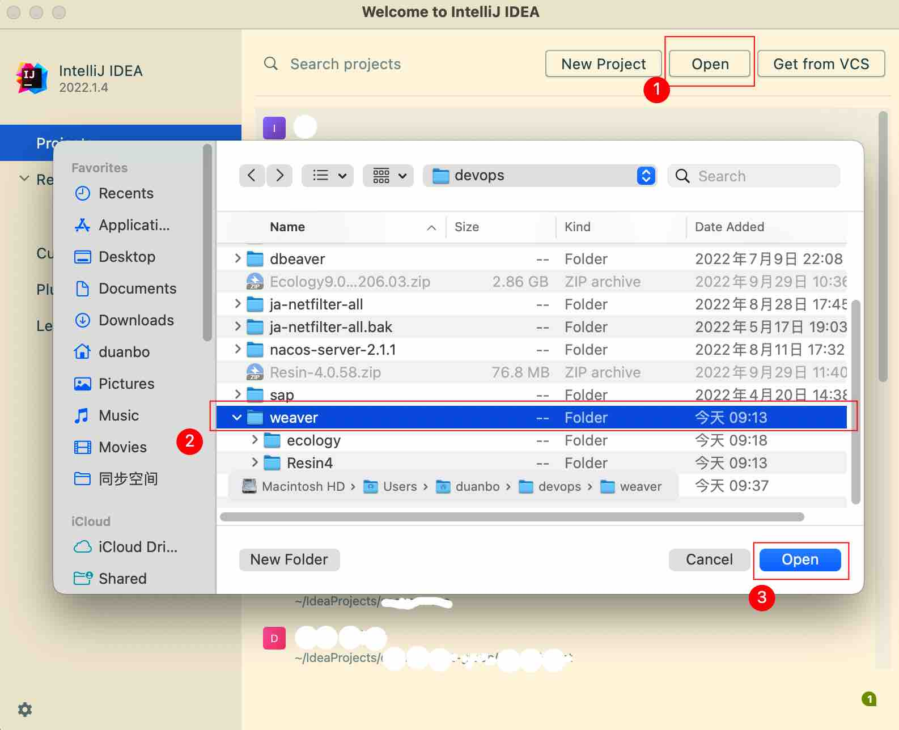

### 设置项目

#### 设置 JDK

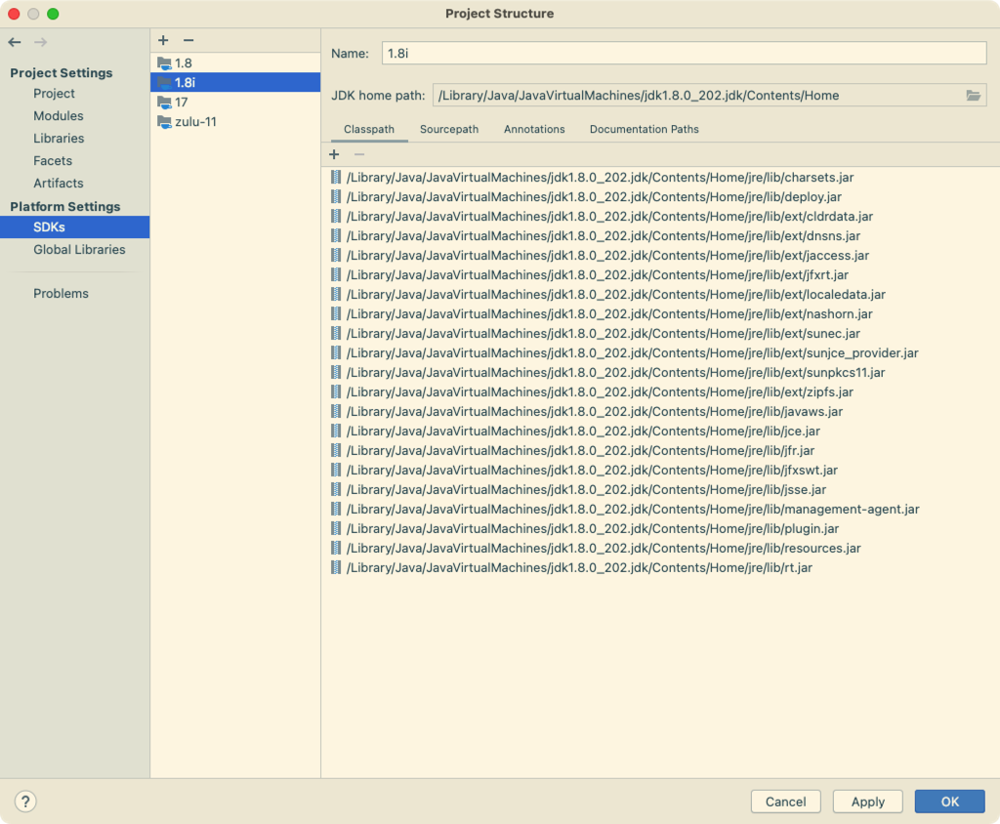

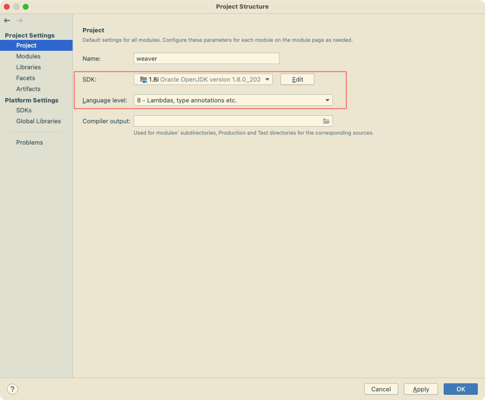

#### 设置 Facets

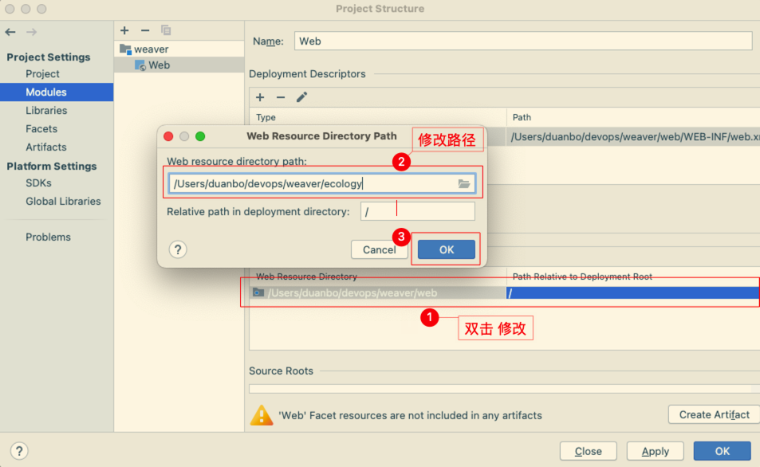

#### 设置 Libraries

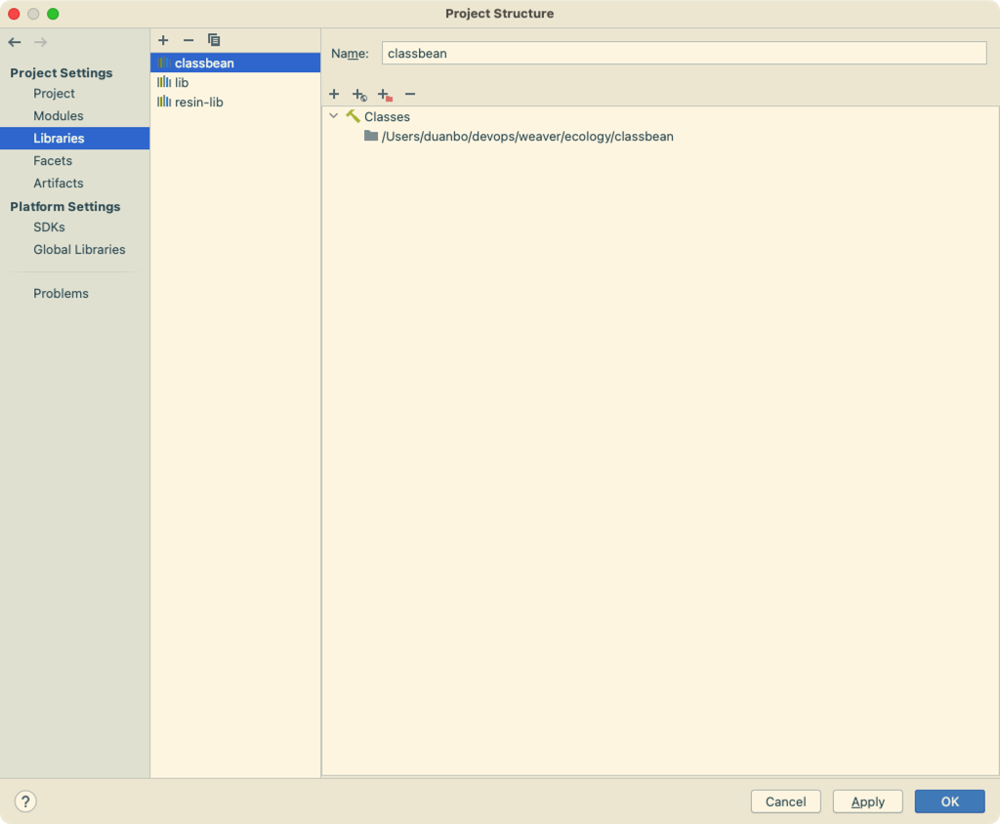

#### 设置 Modules

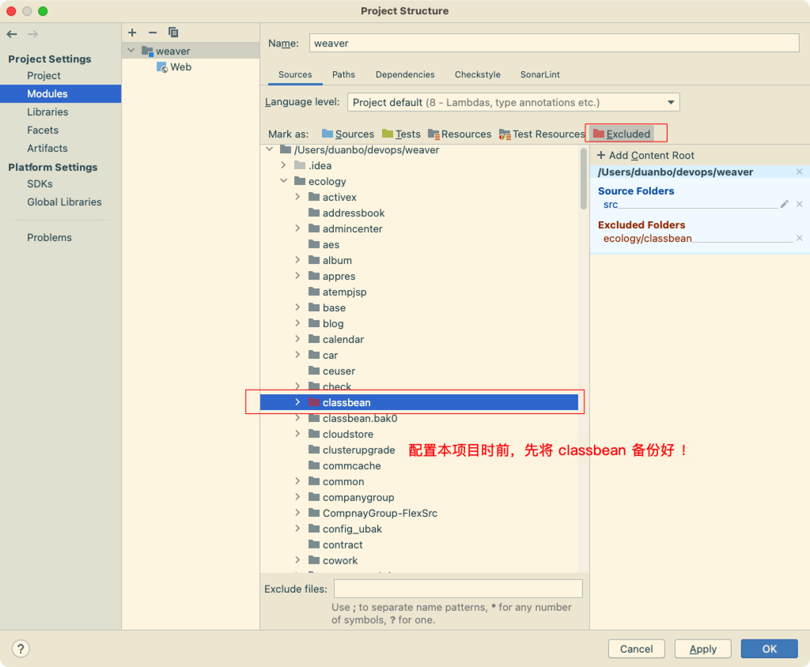

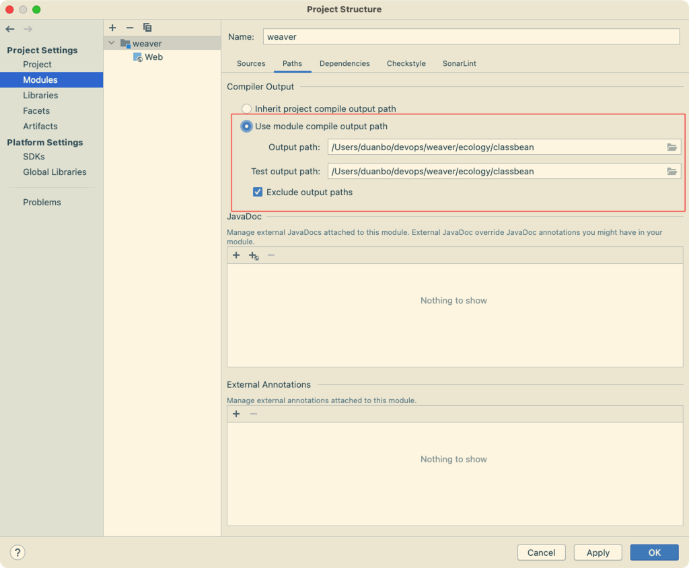

#### 编译检查

------

## IDEA Resin 运行

### 安装 Resin 插件

### 设置 Resin

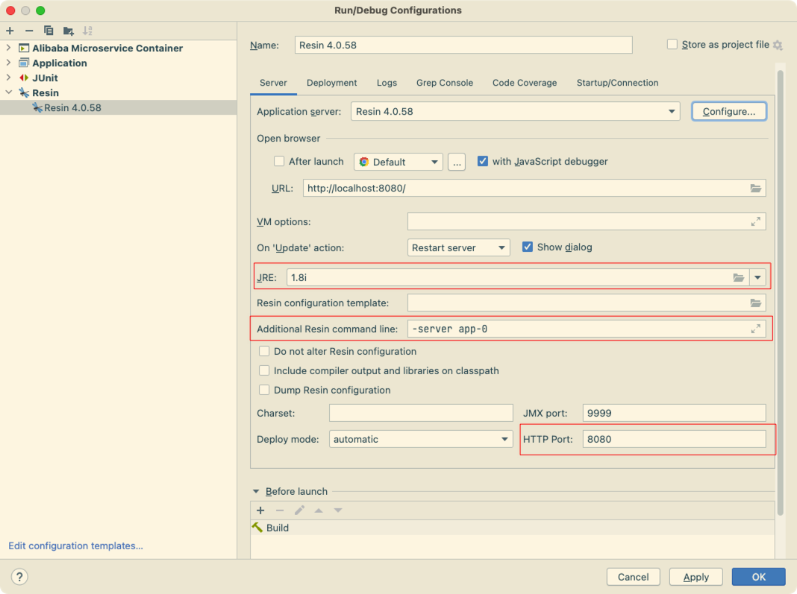

### 启动 Resin

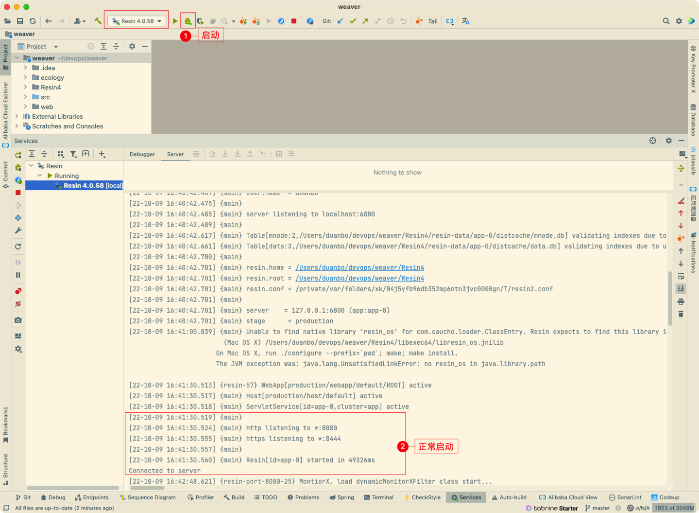

### 访问 Resin

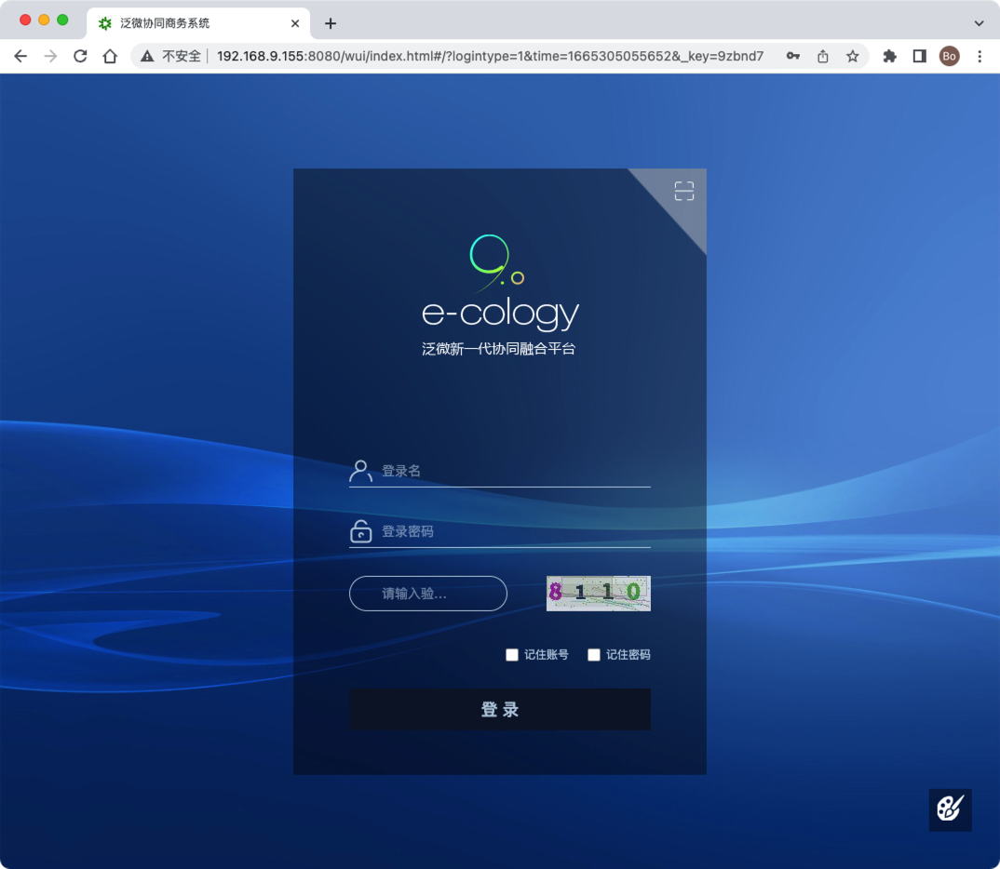

------

## 附录

### 可能访问页面为空白的问题

#### 问题描述

> 是由于环境参数中的路径有包括空格字符的路径，导致 jsp 编译时就出现了异常：500 (Internal Server Error)

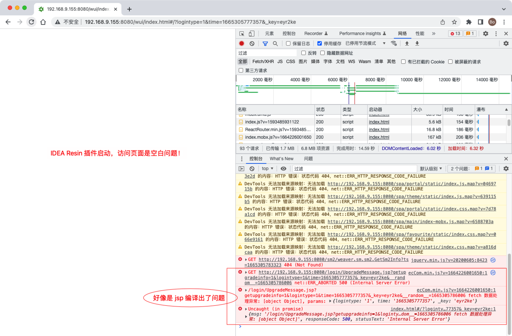

#### 修复方案

> 将 `IntelliJ IDEA.app` 重命名为 `IntelliJIDEA.app` 去掉中间的空格，后再重新打开 IDEA 后，再启动 Resin 。

